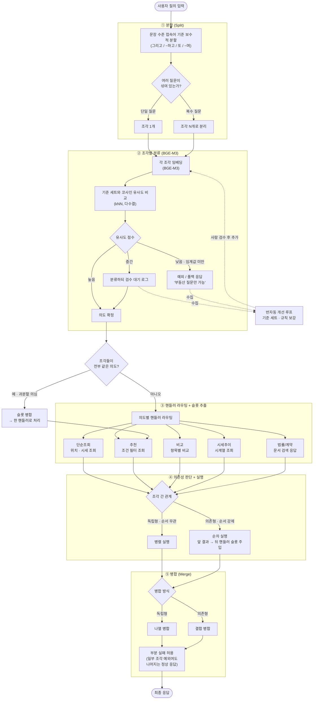

# 챗봇 질의 처리 파이프라인 설계

> 부동산 실거래가 데이터 서비스의 챗봇 — 사용자 자연어 질의를 해석해 적절한 처리 경로로 연결하는 부분에 대한 설계 문서

---

## 1. 개요

부동산 실거래가 데이터를 쉽게 알려주는 웹 서비스를 만들면서, 사용자가 데이터를 더 직관적으로 조회할 수 있도록 챗봇을 도입하기로 했다.

문제는 사용자의 질문이 **같은 의도를 가지고 있어도 표현(단어·문장 구조·흐름)이 제각각**이라는 점이다. 예를 들어 "은마아파트 어디 있어?"와 "은마아파트 위치 알려줘"는 표현이 다르지만 결국 같은 답으로 이어져야 한다. 이렇게 다양하게 들어오는 질의를 의도 단위로 묶어 **하나의 일관된 처리 흐름으로 수렴시키는 파이프라인**이 필요하다고 판단했다.

본 문서는 이 질의 처리 파이프라인의 설계 내용을 정리한다.

**핵심 포인트**

- 사용자 질의는 표현이 다양하지만, 의도는 한정된 유형으로 분류할 수 있다.
- 따라서 질의를 먼저 **유형별로 분류**한 뒤, 유형에 맞는 처리 로직으로 라우팅하는 구조를 가진다.
- 질의 유형은 크게 **조건 기반 조회**(지역·가격·세대수 등 파라미터 추출 후 DB 조회)와 **의미 기반 응답**(임베딩·유사도, 문서 검색)으로 나뉜다.
- 별도의 분류 모델 학습 없이, 기성 임베딩 모델(BGE-M3)과 DB 조회·문서 검색을 조합해 구현한다.
- 본 문서의 범위는 **질의를 해석하고 적절한 처리 경로로 연결하는 부분**까지이며, 응답 문장 생성·UI는 다루지 않는다.

> 본 프로젝트는 실험(프로토타입) 목적이다. 임계값 등 일부 수치는 고정값으로 박지 않고 "실험으로 결정"으로 둔다.

---

## 2. 질의 유형

설계의 출발점으로, 실제 들어올 질의 예시를 수집해 일반화했다. 고유명사(아파트명·역명·지역명)와 숫자(가격·세대수·평수 등)는 사용자마다 바뀌는 값이므로 변수 자리(`○○`, `○`)로 표기한다. 이 변수 자리는 이후 **슬롯(파라미터) 추출** 단계와 직접 연결된다.

| # | 일반화 질의 | 비고 |
|---|-------------|------|
| 1 | ○○아파트 어디 있어? | 위치 조회 |
| 2 | ○○아파트 얼마야? | 시세 조회 |
| 3 | ○억 예산 아파트 추천. | 가격 조건 |
| 4 | ○○세대 이상 아파트 ○개? | 세대수 조건 |
| 5 | 자녀가 ○명인데 몇 평이 좋을까? | 조언성 질의 |
| 6 | ○○역 근처 아파트 알려줘. | 지역 조건 |
| 7 | ○○아파트랑 ○○아파트를 비교해줘. | 비교 |
| 8 | ○억 아파트 매매 시 알아야 할 법률이 뭔가? | 법률/계약 |
| 9 | 신축 아파트를 추천해줘. | 신축 조건 |
| 10 | 근처에 초등학교가 있는 아파트를 추천해줘. | 학군 조건 |
| 11 | 최근에 가장 많이 오른 아파트. | 시세 추이 |
| 12 | ○구의 아파트 시세 변화 추이를 알려줘. | 시세 추이 |
| 13 | ○○아파트가 근 ○년 내에 올랐어? | 시세 추이 |
| 14 | ○평 이상 아파트 ○곳 추천. | 평수 조건 |
| 15 | 매매 계약 시 확인할 사항. | 법률/계약 |

> 위 예시들은 표현은 달라도 의도는 한정적이다. 13·14번 등 원문이 모호했던 항목은 의미상 보정해 정리했다.

---

## 3. 분류 기준

### 3.1 분류 방식

사용자 질의를 **임베딩 기반 의도 분류** 방식으로 처리한다. 별도의 분류 모델을 학습하지 않고, 의도별 대표 문장을 미리 임베딩해 기준 세트로 저장한 뒤, 들어온 질의를 **가장 가까운 대표 문장의 의도로 분류**한다.

- 분류기를 훈련하는 것이 아니라, 미리 정의된 예시 중 가장 유사한 것을 찾는 **최근접 비교(nearest neighbor)** 방식이다.
- 기준 세트는 **고정**이며, 들어온 질의는 분류에만 사용되고 기준 세트에 자동 합류하지 않는다.
- 임베딩 모델은 **BGE-M3**를 사용한다. (다국어·한국어 성능, 무료 자체 호스팅 가능)

### 3.2 의도(Intent) 정의

질의는 다음 의도 중 하나로 분류한다.

| 의도 | 설명 | 예시 질의 |
|------|------|-----------|
| `단순조회` | 특정 아파트의 위치·시세 조회 | ○○아파트 어디 있어 / 얼마야 |
| `추천` | 조건(가격·세대수·신축·학군·지역)에 맞는 아파트 목록 | ○억 예산 추천 / 초등학교 근처 추천 |
| `비교` | 둘 이상의 아파트를 항목별 비교 | A아파트랑 B아파트 비교해줘 |
| `시세추이` | 가격 변화·상승 추이 (시계열) | 시세 변화 추이 / 최근 많이 오른 곳 |
| `법률/계약` | 매매·계약 관련 법률 지식 응답 | 매매 시 알아야 할 법률 / 계약 시 확인사항 |

### 3.3 기준 세트 구성 원칙

각 의도는 대표 문장을 **1개가 아니라 여러 개(표현 변형)** 보유한다. 동일 의도라도 사용자의 표현(문체·격식·어순·동의어)이 다양하므로, 기준에 다양성이 깔려 있어야 어떤 표현으로 들어와도 가까운 예시가 잡힌다.

- 의도당 **5~10개** 수준의 표현 변형을 둔다.
- 변형 시 의식하는 축:
  - 문체 — "추천해줘 / 추천 / 골라줘 / 알려줘"
  - 격식·구어 — "위치 알려주세요 / 어디임?"
  - 어순·생략 — "서초역 근처 아파트 / 아파트 중에 서초역 가까운 거"
  - 동의어 — 시세=가격=얼마, 근처=주변=인근, 추천=골라줘=찾아줘
- **의도 경계를 흐리는 모호한 문장은 기준에서 제외**한다. (다른 의도 분류를 방해할 수 있음)

### 3.4 분류 흐름

```
질의 입력
 → 질의 임베딩 (BGE-M3)
 → 기준 세트 전체와 코사인 유사도 비교
 → 가장 가까운 k개의 의도로 다수결 판정 (kNN)
 → 의도 확정 → 해당 핸들러로 라우팅
```

> 분류는 "어느 핸들러로 보낼지"까지만 책임진다. 핸들러 내부에서 무엇을 할지는 슬롯(지역·가격 등 파라미터) 추출이 결정하며, 이는 4장에서 다룬다.

### 3.5 유사도 점수 기반 처리 분기

임베딩 분류는 어떤 질의든 "가장 가까운 의도"를 반드시 하나 반환한다. 따라서 그 결과를 신뢰할지는 **유사도 점수**로 판단하며, 점수 구간에 따라 처리를 분기한다.

```
유사도 점수
 ├─ 높음   → 분류 확정, 정상 처리
 ├─ 중간   → 분류하되 "검수 대기"로 로그 기록 (개선 루프 대상)
 └─ 낮음   → 임계값 미만 → 예외/폴백 처리
```

- **임계값(threshold)** 미만이면 "걸린 의도가 없다"고 판단하고 폴백 응답을 반환한다. (예: "부동산 관련 질문만 답변할 수 있어요")
- 구간 경계값(예: 높음 0.8↑ / 낮음 0.5↓)은 고정값이 아니라 **실험을 통해 결정**한다. 너무 높으면 정상 질의가 예외로 떨어지고, 너무 낮으면 무관한 질의가 억지로 분류된다.

### 3.6 예외 처리

- 가장 가까운 의도의 유사도가 임계값 미만인 질의는 **분류 실패(예외)** 로 처리한다.
- 부동산과 무관한 질의, 의도 정의에 없는 신규 유형이 여기에 해당한다.
- 예외 질의는 폴백 응답과 함께 **별도 로그로 수집**한다. (신규 의도 발굴 근거)

### 3.7 반자동 개선 루프

분류 정확도는 운영하면서 점진적으로 보강한다. 단, 자동 학습이 아니라 **사람 검수를 거친 반자동** 방식으로 한다.

```
운영 중 유사도 점수·분류 결과를 로그로 기록
 → "중간 점수(검수 대기)" 질의를 주기적으로 검토
 → 올바른 의도로 확인된 표현을 기준 세트에 추가
 → 다음 분류부터 해당 표현 흡수
```

- 자동으로 기준 세트에 추가하지 않는다. (오분류가 기준을 오염시킴)
- **전제 조건: 질의·유사도 점수·분류 결과의 로깅.** 로그가 없으면 무엇을 보강할지 판단할 수 없다.

---

## 4. 핸들러 설계

분류된 의도는 각 의도에 대응하는 **핸들러**로 라우팅된다. 핸들러는 "근본적으로 다른 일" 단위로 나뉘며, 각자 정해진 슬롯(파라미터)을 입력으로 받아 자기 일만 수행하고 결과를 반환한다. 같은 일에 조건만 다른 경우는 핸들러를 나누지 않고 슬롯으로 흡수한다.

### 4.1 핸들러 단위 기준

- **입력 슬롯이 같고 출력 형태가 같으면** 하나의 핸들러로 묶는다.
- **둘 중 하나라도 본질적으로 다르면** 별도 핸들러로 분리한다.
- 같은 일을 조건별로 잘게 쪼개지 않는다. (예: 예산추천·학군추천을 따로 만들지 않음 — 모두 "추천" 한 핸들러가 슬롯만 다르게 처리)

### 4.2 핸들러별 처리 방식

**단순조회 핸들러**
특정 아파트의 위치나 시세를 묻는 질의를 처리한다. 질의에서 아파트명을 추출해, 해당 아파트의 기본 정보(위치·실거래가 등)를 DB에서 조회해 반환한다.

**추천 핸들러**
조건에 맞는 아파트 목록을 반환한다. 질의에서 가격·세대수·신축 여부·학군·지역 등 **언급된 조건만** 슬롯으로 추출하고, 채워진 슬롯을 필터로 조립해 DB를 조회한다. 여러 조건이 섞인 질의도 슬롯이 합쳐지는 방식으로 자연스럽게 처리된다.

**비교 핸들러**
둘 이상의 아파트를 나란히 비교한다. 질의에서 비교 대상 아파트들을 추출하고, 각 아파트의 정보를 가져와 항목별(가격·면적·세대수 등)로 정리해 반환한다.

**시세추이 핸들러**
가격 변화·상승 추이를 시계열로 반환한다. 질의에서 대상(아파트 또는 지역)과 기간을 추출해, 해당 기간의 시세 데이터를 시간 순으로 조회해 반환한다.

**법률/계약 핸들러**
매매·계약 관련 법률 지식을 응답한다. 단순 DB 조회가 아니라, 질의 내용을 법률·계약 관련 문서에서 검색해 관련 내용을 찾아 응답한다. (RAG/문서 검색 방식)

### 4.3 공통 원칙

- 각 핸들러는 **입력(슬롯) → 처리 → 출력**이 독립적으로 완결된다.
- 핸들러는 자신이 받는 슬롯만 알면 되고, 분류기나 다른 핸들러의 내부를 알 필요가 없다.
- 새로운 의도가 추가되면 **핸들러를 하나 추가**하면 되며, 기존 핸들러는 수정하지 않는다.

---

## 5. 복수 질문 처리

### 5.1 복수 질문의 정의

복수 질문을 다루기 전에, **복수 조건**과 **복수 질문**을 구분해야 한다. 둘은 다르며, 혼동하면 설계가 꼬인다.

- **복수 조건 (단일 질문)** — "서초역 근처 30억대 신축 아파트 추천해줘"는 조건이 여러 개(지역·가격·신축)지만 의도는 `추천` 하나다. 추천 핸들러가 슬롯을 조립하면 끝나며, 핸들러 설계에서 이미 해결된 경우다.
- **복수 질문** — "30억대 아파트 추천해주고, 매매 시 알아야 할 법률도 알려줘"는 의도가 둘(`추천` + `법률`)이고 서로 다른 핸들러를 호출해야 한다.

> **기준: 호출해야 할 핸들러가 2개 이상이면 복수 질문, 1개면 (조건이 아무리 많아도) 단일 질문이다.**

### 5.2 별도 처리가 필요한 이유

임베딩 분류기는 문장 하나를 통째로 임베딩해 **가장 가까운 의도 1개**만 반환한다. 따라서 "추천해주고 법률도 알려줘"를 통째로 분류하면 추천·법률 중 한쪽으로만 잡히고 나머지는 사라진다. 복수 질문은 분류 **이전에** 먼저 분할해야 한다.

### 5.3 처리 흐름

```
질의 입력
 → ① 분할(Split)    : 여러 질문이 섞였으면 조각으로 나눔
 → ② 조각별 분류     : 각 조각에 기존 분류 흐름 그대로 적용 (임베딩→의도→임계값)
 → ③ 의존성 판단     : 조각들이 독립인가, 앞 결과에 의존하는가
 → ④ 실행           : 독립이면 병렬, 의존이면 순차
 → ⑤ 병합(Merge)    : 조각별 결과를 하나의 응답으로 합침
```

새로 추가되는 핵심 로직은 **분할(①)**, **의존성 판단(③)**, **병합(⑤)** 이며, 분류와 핸들러는 기존 설계를 그대로 재사용한다.

### 5.4 의존성 판단과 실행 순서 (③④)

조각들의 관계에 따라 실행 순서와 방식이 갈린다. 여기서 **순서는 임의로 정하는 것이 아니라, 조각 간 의존 관계가 순서를 결정한다.**

**독립형 — 순서 무관, 병렬**
조각들이 서로 무관해 어느 것을 먼저 처리하든 결과가 같다.
> "은마아파트 위치랑 잠실 엘스 시세 알려줘" → 위치 조회와 시세 조회가 무관 → 순서 상관없이 각각 처리

**의존형 — 순서 강제, 순차**
뒤 조각이 앞 조각의 결과를 입력으로 받아야 하므로 순서가 고정된다.
> "가장 많이 오른 아파트 찾아서, 그거 매매 시 법률 알려줘" → 시세추이 핸들러 결과(특정 아파트)가 법률 핸들러의 입력 → 시세추이를 **반드시 먼저** 실행

의존형은 **"그중에", "거기서", "둘 중", "그것들 중", "그거"** 같은 지시 표현이 신호다. 이 표현이 보이면 앞 조각의 출력을 뒤 조각으로 넘긴다.

> 실험 단계에서는 "의존형이면 순차 / 독립형이면 병렬" 두 갈래로 충분하다. 다수 조각이 복잡하게 얽히는 의존성 그래프까지는 다루지 않는다.

### 5.5 의존형 결과 전달 방식

의존형의 핵심은 앞 핸들러의 출력이 뒤 핸들러의 **입력 슬롯으로 주입**되는 것이다.

```
"가장 많이 오른 아파트 찾아서, 그거 매매 시 법률 알려줘"

1) 시세추이 핸들러 실행
   출력: 특정 아파트(○○)

2) 그 출력을 다음 조각의 입력 슬롯으로 주입
   법률 핸들러 입력: {대상: ○○}

3) 법률 핸들러가 해당 대상 기준으로 응답
```

- 이를 위해 핸들러는 **앞 결과(대상·목록 등)를 입력 슬롯으로 받을 수 있는 형태**여야 한다.
- 앞 결과가 뒤 핸들러의 **검색 범위를 좁혀주는** 형태가 대부분이다. (전체 DB 조회 → 넘겨받은 범위 내 조회)

> 참고: "30억대 추천하고 그중에 초등학교 있는 곳"처럼 **같은 핸들러 내 조건 추가**로 볼 수 있는 경우는, 의존형으로 분리하기보다 슬롯을 병합해 한 핸들러로 처리하는 편이 깔끔하다(5.6 함정 1의 안전장치). 진짜 의존형은 **서로 다른 종류의 핸들러끼리 결과를 물려줄 때**다.

### 5.6 분할의 함정

**함정 1 — 과분할**
조건마다 끊으면 단일 질문이 깨진다. "서초역 근처 30억 신축 추천"을 조건별로 쪼개면 안 된다. 분할은 **문장 수준 접속**(그리고, ~하고, 또, ~며)에서만 보수적으로 끊는다.

- 안전장치: 쪼갠 조각들이 **전부 같은 의도로 분류되면**, 사실 한 질문일 가능성이 높다. 이 경우 다시 합쳐 **슬롯을 병합해 한 핸들러**로 보낸다.

**함정 2 — 한국어 분할의 어려움**
접속사 기반 규칙 분할은 대부분을 잡지만 완벽하지 않다.

- **규칙 기반** — 접속사·연결어미로 분할. 단순하고 별도 모델이 불필요해 "임베딩 중심" 기조에 부합한다. *(1차 채택)*
- **LLM 분해** — 질문 분해를 가벼운 LLM 호출에 맡기면 가장 견고하나, 외부 의존이 생긴다.

→ 규칙 기반으로 시작하고, **분할 실패 사례를 로그로 수집**해 점진 보강한다.

### 5.7 결과 병합 (⑤)

여러 핸들러를 거친 결과 조각들을 하나의 응답으로 합친다. 병합 방식은 의존성 유형에 따라 다르다.

**독립형 → 나열**
조각들이 서로 무관하므로 각 결과를 순서대로 나열한다.
```
은마아파트 위치: 서울 강남구 ...
잠실 엘스 시세: 23억 ...
```

**의존형 → 결합**
결과가 하나로 이어진 흐름이므로, 나열하지 않고 한 덩어리로 묶는다.
```
가장 많이 오른 ○○아파트의 매매 시 확인할 법률은 ... 입니다.
```

> 조각 결과를 LLM에 넘겨 자연어로 매끄럽게 합치는 방식(자연어 병합)도 가능하나, 이는 **응답 생성** 영역으로 본 문서 범위(질의 해석·라우팅)를 벗어난다. 실험 단계에서는 독립형=나열, 의존형=템플릿 결합으로 처리한다.

### 5.8 병합과 부분 실패

조각별 결과를 합칠 때, **한 조각이 임계값 미만(예외)이어도 나머지 조각은 정상 응답**해야 한다.

- 예) "은마 시세랑 오늘 날씨 알려줘" → 시세는 응답, 날씨는 "답변할 수 없음" → **부분 성공** 허용
- 전부 성공 아니면 전부 실패(all-or-nothing)로 처리하지 않는다.

---

## 6. 테스트 / 검증

### 6.1 테스트 원칙

복수 질문 처리는 여러 단계(분할 → 분류 → 임계값 → 병합)를 거치므로, 최종 응답만 보는 통합 테스트로는 어느 단계에서 틀렸는지 알 수 없다. 따라서 **단계별로 끊어서 측정**한 뒤 통합 테스트로 마무리한다.

- 테스트는 분류 → 임계값 → 분할 → 통합 순으로, **하위 단계부터** 검증한다.
- 틀린 케이스는 폐기하지 않고 **로그로 수집**해 기준 세트·분할 규칙 보강(반자동 개선 루프)의 입력으로 사용한다.

### 6.2 테스트 데이터 원칙

모든 테스트의 전제는 **라벨링된 질문 세트**다. 각 질문에 정답 의도(및 복수 질문 여부·분할 결과)를 미리 부여해 두고 채점한다.

**가장 중요한 규칙: 테스트 세트는 기준 세트와 겹치지 않아야 한다.**

| 구분 | 용도 | 구성 |
|------|------|------|
| 기준 세트 | 분류의 잣대 (BGE-M3에 미리 임베딩) | 의도별 대표 표현 |
| 테스트 세트 | 잣대를 평가 (채점용) | 기준에 없는 **새로운 표현** + 정답 라벨 |

기준 세트에 있는 문장을 그대로 테스트하면 자기 자신과 비교하므로 항상 통과한다. 이는 일반화 성능이 아니라 착시다. 따라서 테스트 질문은 같은 의도이되 **기준 세트에 없는 표현**으로 작성한다.

### 6.3 단계별 테스트

**① 분류 정확도**
의도를 라벨링한 단일 질문 세트로, 분류 결과가 정답 라벨과 일치하는지 측정한다.

- 지표: 전체 정확도, 의도별 정확도
- **혼동 행렬(confusion matrix)** 을 작성해 어떤 의도끼리 자주 혼동되는지 확인한다.
- 특정 의도쌍이 자주 섞이면, 두 의도의 기준 세트 표현이 지나치게 유사하다는 신호 → 해당 표현을 조정하거나 의도 경계를 다듬는다.

**② 임계값 튜닝**
정상 질의에 **부동산과 무관한 질의**(날씨·점심 등)를 일부러 섞어, 임계값을 0.4 / 0.5 / 0.6 … 으로 바꿔가며 측정한다.

- 목표: **정상 질의는 통과시키고 무관 질의는 예외로 걸러내는** 경계값을 찾는다.
- 한 번에 정해지지 않으며, 값을 쓸어보며(sweep) 정상 통과율과 무관 차단율이 균형을 이루는 지점을 택한다.
- 이렇게 정한 값을 분류 흐름의 임계값으로 확정한다. (3.5와 연결)

**③ 분할 정확도**
단일 질문과 복수 질문을 섞은 세트로, 분할이 올바른지 측정한다.

- 확인 항목: **쪼개야 할 질문을 쪼갰는가 / 쪼개지 말아야 할 질문을 안 쪼갰는가.**
- 과분할("서초역 30억 신축"을 조건별로 분리)과 미분할(복수 질문을 한 덩어리로 둠)이 여기서 잡힌다.
- 지표: 분할 정확도, 과분할·미분할 발생 건수.

**④ 통합 테스트**
실제 질의를 분할 → 분류 → 실행 → 병합까지 끝까지 흘려 최종 응답을 확인한다.

- ①~③이 모두 통과한 뒤에 수행한다. (하위 단계가 깨진 상태로 통합을 보면 원인 추적이 불가능)
- 독립형(나열 병합)·의존형(결합 병합)·부분 실패(일부 조각만 예외) 케이스를 각각 포함한다.
- 의존형은 **실행 순서가 지켜졌는지**(앞 결과가 뒤 핸들러로 주입됐는지)를 함께 확인한다.

### 6.4 테스트와 개선 루프의 연결

각 단계에서 틀린 케이스는 그대로 **반자동 개선 루프(3.7)의 입력**이 된다.

```
분류 오답   → 기준 세트에 표현 보강
임계값 경계 → 임계값 재조정
분할 실패   → 분할 규칙 보완 / 예외 표현 수집
```

즉 테스트는 일회성 합격/불합격 판정이 아니라, **틀린 사례를 모아 기준 세트와 규칙을 키워가는 출발점**이다. 테스트와 운영 중 개선이 같은 흐름으로 이어진다.

### 6.5 범위 한계

- 본 테스트는 **질의 해석·라우팅의 정확도**(분류·분할·실행 순서·병합 구조)를 검증한다.
- 응답 문장의 자연스러움·정확성(응답 생성 품질)은 본 문서 범위 밖이며, 별도 검증 대상이다.
- 실험 단계에서는 정량 지표(정확도·혼동 행렬)와 함께, 틀린 케이스의 **정성 검토**를 병행해 개선 방향을 잡는다.

---

## 7. 처리 흐름 (전체 파이프라인)

아래 다이어그램은 1~6장의 설계를 하나의 처리 흐름으로 통합한 것이다. 질의 입력부터 최종 응답까지의 단계와 분기, 그리고 개선 루프로의 피드백을 함께 표현한다.



### 흐름 요약

- **①** 문장 접속 단위로만 보수적으로 분할 — 과분할 방지.
- **②** 조각마다 BGE-M3 임베딩 → 유사도 점수로 **높음(확정) / 중간(검수 대기) / 낮음(폴백)** 3분기.
- **과분할 안전장치** — 조각이 전부 같은 의도면 다시 슬롯 병합해 한 핸들러로.
- **③** 의도별 5개 핸들러로 라우팅, 슬롯 추출.
- **④** 독립형은 병렬, 의존형은 순차(앞 결과를 뒤 슬롯으로 주입).
- **⑤** 독립형은 나열, 의존형은 결합, **부분 실패 허용**.
- **개선 루프** — 검수 대기·폴백 로그가 사람 검수를 거쳐 기준 세트로 환류.

---

## 부록: 용어 정리

| 용어 | 의미 |
|------|------|
| 기준 세트 | 의도별 대표 문장 모음. BGE-M3로 미리 임베딩해 분류의 잣대로 사용 (고정) |
| 의도(Intent) | 질의가 속하는 처리 유형. 핸들러가 갈리는 지점에 맞춰 정의 |
| 슬롯(Slot) | 핸들러가 입력으로 받는 파라미터 (지역·가격·세대수 등) |
| 핸들러 | "근본적으로 다른 일" 단위의 처리 모듈. 입력→처리→출력이 독립 완결 |
| 임계값(Threshold) | 분류 신뢰 여부를 가르는 유사도 경계값. 실험으로 결정 |
| 개선 루프 | 검수 대기·예외 로그를 사람 검수 후 기준 세트에 반영하는 반자동 보강 과정 |