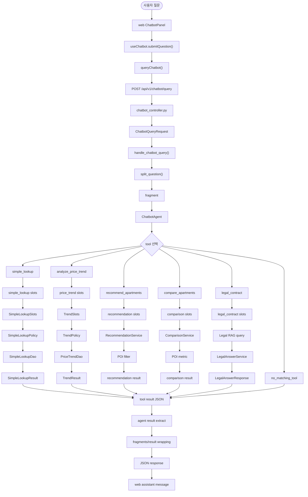

# 챗봇 질의 처리 파이프라인

이 문서는 `web`의 챗봇 패널에서 입력된 자연어 질문이 `server`의 Agent, tool, feature service를 거쳐 JSON 응답으로 돌아오는 흐름을 설명한다.

---

## 1. 전체 흐름

챗봇 요청은 다음 계층을 순서대로 지난다.

```text
사용자 질문
-> web ChatbotPanel
-> POST /api/v1/chatbot/query
-> ChatbotQueryRequest
-> handle_chatbot_query()
-> split_question()
-> ChatbotAgent
-> tool 선택 및 실행
-> slots 추출/병합
-> feature service
-> DAO 또는 RAG 조회
-> tool result JSON
-> fragment/result 응답
-> web 채팅 메시지 렌더링
```

각 계층의 책임은 다음과 같다.

| 계층 | 책임 |
|------|------|
| `web` | 사용자 입력 수집, API 호출, 서버 JSON 응답 표시 |
| controller | HTTP 요청 body 검증, service 호출 |
| chatbot service | 질문 분할, fragment 실행, 최종 응답 wrapping |
| Agent | 질문 내용에 맞는 tool 선택 |
| tool | LLM tool args와 규칙 기반 slots 병합, feature service 호출 |
| feature service | 비즈니스 use case 실행 |
| DAO/RAG | DB 조회, 주변 시설 조회, 법령 문서 검색 |
| DTO | 요청/slot/criteria/result 형태 검증 |
| policy | slot을 실제 조회 조건으로 정규화 |

---

## 2. Web 계층

관련 파일:

- `web/src/features/chatbot/api/queryChatbot.ts`
- `web/src/features/chatbot/useChatbot.ts`
- `web/src/features/chatbot/ChatbotPanel.tsx`
- `web/src/app/styles/chatbot.css`
- `web/src/app/App.tsx`

### 2.1 요청 흐름

```text
ChatbotPanel
-> useChatbot.submitQuestion()
-> queryChatbot(question)
-> fetch("/api/v1/chatbot/query")
-> assistant message 추가
```

`queryChatbot()`은 사용자 질문을 다음 body로 전송한다.

```json
{
  "question": "잠실 근처 10억 이하 아파트 추천해줘"
}
```

서버 응답은 feature별로 카드화하지 않고 채팅 메시지 안에 JSON 객체 형태로 표시한다. 이 때문에 `web`은 handler별 의미를 해석하지 않고, 요청/응답 UI만 담당한다.

### 2.2 UI 상태

`useChatbot()`은 챗봇 UI의 상태를 관리한다.

| 상태 | 의미 |
|------|------|
| `inputValue` | textarea 입력값 |
| `messages` | 사용자/assistant 메시지 목록 |
| `requestState` | `idle`, `loading`, `error` |
| `submitQuestion()` | 질문 전송 및 응답 message 추가 |

`App.tsx`는 챗봇 패널의 열림/닫힘만 관리한다.

```tsx
const [isChatbotOpen, setIsChatbotOpen] = useState(false);
const chatbot = useChatbot();
```

`ChatbotPanel`은 `map-workspace`의 마지막 자식으로 렌더링되어 지도 위 오른쪽 하단에 놓인다.

---

## 3. API 진입점

관련 파일:

- `server/app/chatbot/controller/chatbot_controller.py`
- `server/app/chatbot/dto/chatbot_dto.py`
- `server/app/chatbot/service/chatbot_service.py`

요청 DTO:

```py
class ChatbotQueryRequest(BaseModel):
    question: str = Field(min_length=1)
```

controller는 HTTP body를 `ChatbotQueryRequest`로 검증한 뒤 `handle_chatbot_query()`에 넘긴다.

```text
POST /api/v1/chatbot/query
-> ChatbotQueryRequest
-> handle_chatbot_query(payload.model_dump(), session)
```

controller의 책임은 HTTP 경계 처리다. 질문 분할, tool 실행, feature service 호출은 chatbot service 아래에서 처리한다.

---

## 4. 질문 분할

관련 파일:

- `server/app/chatbot/service/splitter.py`
- `server/app/chatbot/service/chatbot_service.py`

사용자 질문에 여러 요청이 섞여 있으면 `split_question()`이 규칙 기반으로 조각을 만든다.

분할 기준 예시:

```text
그리고
또
추천하고
조회하고
알려주고
찾아주고
해주고
추천해주고
찾아보고
```

처리 흐름:

```text
원문 question
-> split_question(question)
-> fragment list
-> fragment별 ChatbotAgent 실행
-> fragment result 수집
-> fragments/result 응답 구성
```

fragment가 하나면 `result`에는 단일 객체가 들어간다. fragment가 여러 개면 `result`에는 각 fragment의 결과 배열이 들어간다.

---

## 5. Agent 계층

관련 파일:

- `server/app/chatbot/service/agent.py`
- `server/app/chatbot/service/tools/__init__.py`

`ChatbotAgent`는 LangChain `create_agent()`로 만들어진다. Agent는 사용자의 질문을 보고 호출할 tool을 고른다.

등록된 tool:

| Tool | 담당 기능 |
|------|-----------|
| `simple_lookup` | 단지/지역 실거래, 면적, 기간 기반 조회 |
| `recommend_apartments` | 조건 기반 아파트 추천 |
| `compare_apartments` | 여러 단지 비교 |
| `analyze_price_trend` | 가격 추이/변동률 분석 |
| `legal_contract` | 부동산 계약/법령 RAG 답변 |

Agent의 출력은 tool message에 담긴 JSON 문자열이다. `agent.py`의 helper가 tool message에서 JSON을 추출해 service 응답에 넣는다.

```text
ChatbotAgent.run(fragment)
-> LangChain messages
-> tool call
-> tool message content
-> JSON parse
-> fragment.result
```

Agent가 질문을 처리할 tool을 고르지 못하면 `no_matching_tool` 형태의 result가 만들어진다.

---

## 6. Tool 계층

관련 파일:

- `server/app/chatbot/service/tools/simple_lookup_tool.py`
- `server/app/chatbot/service/tools/recommendation_tool.py`
- `server/app/chatbot/service/tools/comparison_tool.py`
- `server/app/chatbot/service/tools/price_trend_tool.py`
- `server/app/chatbot/service/tools/legal_contract_tool.py`

tool 함수는 Agent와 feature service 사이의 adapter다.

주요 책임:

1. 자연어 질문을 feature별 `slots.py` 추출기에 전달한다.
2. Agent가 넘긴 LLM tool args를 slot dict에 병합한다.
3. feature service의 실행 진입점을 호출한다.
4. service 결과를 JSON으로 반환한다.

일반적인 tool 흐름:

```text
tool(query, **llm_args)
-> extract_*_slots(query)
-> slots.update(llm_args)
-> run_* 또는 Service.run()
-> dict result
```

tool은 service를 직접 선택하는 계층이 아니다. service 선택은 Agent가 어떤 tool을 호출했는지로 결정된다.

---

## 7. Slots, DTO, Policy, Service

챗봇 feature는 자연어에서 추출한 값을 바로 DAO에 넘기지 않는다. 기능에 따라 slots, DTO, policy를 거치며 조회 가능한 형태로 정리한다.

| 구성 요소 | 역할 | 예시 |
|-----------|------|------|
| `slots.py` | 자연어 질문에서 기본 slot dict 생성 | `extract_simple_lookup_slots()` |
| LLM tool args | Agent가 구조화해 넘긴 보강 인자 | `complex_name`, `region_name`, `limit` |
| `*Slots` DTO | service 입력 slot 검증 | `SimpleLookupSlots`, `TrendSlots` |
| `policy.py` | slot을 조회 조건으로 정규화 | 기간 변환, 면적 범위 변환 |
| `*Criteria` DTO | DAO가 소비하는 정규화 조건 | `SimpleLookupCriteria`, `TrendCriteria` |
| `service.py` | use case 실행 | `SimpleLookupService.handle()` |
| `dao.py` | DB 조회 | `SimpleLookupDao` |
| `*Result` DTO | tool 응답 JSON 형태 검증 | `SimpleLookupResult`, `TrendResult` |

정형화된 feature의 흐름은 다음과 같다.

```text
tool
-> slots.py 기본 slot 추출
-> LLM tool args 병합
-> *Slots DTO 검증
-> policy.py 정규화
-> *Criteria DTO 생성
-> DAO 조회
-> *Result DTO 생성
-> dict 반환
```

DTO의 역할은 형태 검증과 응답 포맷 관리다. 어떤 service를 호출할지는 DTO가 결정하지 않는다.

---

## 8. Feature별 처리 구조

### 8.1 Simple Lookup

관련 파일:

- `server/app/chatbot/features/simple_lookup/slots.py`
- `server/app/chatbot/features/simple_lookup/dto.py`
- `server/app/chatbot/features/simple_lookup/policy.py`
- `server/app/chatbot/features/simple_lookup/service.py`
- `server/app/chatbot/features/simple_lookup/dao.py`

흐름:

```text
simple_lookup tool
-> extract_simple_lookup_slots(query)
-> LLM args 병합
-> SimpleLookupSlots
-> normalize_simple_lookup_policy()
-> SimpleLookupCriteria
-> SimpleLookupDao
-> SimpleLookupResult
```

`SimpleLookupSlots`는 질문에서 추출한 단지명, 지역명, 면적, 기간, limit 등을 검증한다. `policy.py`는 이 값을 DAO 조회에 맞게 정규화한다.

예시:

```text
"전용 84"
-> area_min / area_max

"최근 1년"
-> start_date / end_date
```

결과는 `SimpleLookupResult`로 감싸져 tool result JSON으로 반환된다.

### 8.2 Price Trend

관련 파일:

- `server/app/chatbot/features/price_trend/slots.py`
- `server/app/chatbot/features/price_trend/dto.py`
- `server/app/chatbot/features/price_trend/policy.py`
- `server/app/chatbot/features/price_trend/service.py`
- `server/app/chatbot/features/price_trend/dao.py`

흐름:

```text
analyze_price_trend tool
-> extract_price_trend_slots(query)
-> LLM args 병합
-> TrendSlots
-> normalize_trend_policy()
-> TrendCriteria
-> PriceTrendDao
-> TrendResult
```

`TrendSlots`는 가격 변화 순위, 단지 추이, 지역 추이처럼 질문 유형을 구분할 수 있는 값을 검증한다. `policy.py`는 기간, 지역, 단지명, 면적 조건을 `TrendCriteria`로 정규화한다.

결과 item은 분석 유형에 따라 다음 DTO로 구성된다.

- `TrendPoint`
- `PriceChangeRankingItem`
- `TrendResult`

### 8.3 Recommendation

관련 파일:

- `server/app/chatbot/features/recommendation/slots.py`
- `server/app/chatbot/features/recommendation/service.py`
- `server/app/chatbot/features/recommendation/filters.py`
- `server/app/chatbot/features/recommendation/infrastructure.py`

흐름:

```text
recommend_apartments tool
-> extract_recommendation_slots(query)
-> LLM args 병합
-> RecommendationService.run(session, slots, text)
-> normalize_slots()
-> 조건 필터
-> POI 거리 필터
-> 추천 결과 dict
```

추천 feature는 사용자의 예산, 지역, 면적, 역/학교 접근성 같은 조건을 slot으로 받고, service 내부에서 조건 필터와 주변 시설 필터를 적용한다.

역세권/학군 조건은 `pois` 테이블의 좌표 데이터를 사용해 계산한다. 추천 결과에는 조건에 맞는 단지 목록과 설명용 `answer`가 포함된다.

### 8.4 Comparison

관련 파일:

- `server/app/chatbot/features/comparison/slots.py`
- `server/app/chatbot/features/comparison/service.py`
- `server/app/chatbot/features/comparison/metrics.py`

흐름:

```text
compare_apartments tool
-> extract_compare_slots(query)
-> LLM args 병합
-> ComparisonService.run(session, slots, text)
-> normalize_slots()
-> 비교 대상 단지 조회
-> metric별 비교값 계산
-> 비교 결과 dict
```

비교 feature는 여러 단지를 대상으로 가격, 면적, 거래 정보, 가까운 역/학교 같은 metric을 계산한다.

metric에 주변 시설 조건이 포함되면 POI 조회를 통해 가장 가까운 시설명과 거리 정보를 붙인다.

### 8.5 Legal Contract

관련 파일:

- `server/app/chatbot/features/legal_contract/slots.py`
- `server/app/chatbot/features/legal_contract/service.py`
- `server/app/chatbot/features/legal_contract/rag/*`

흐름:

```text
legal_contract tool
-> extract_legal_contract_slots(query)
-> LLM args 병합
-> normalize_query()
-> LegalRagQueryService.query()
-> term mapping search
-> keyword search
-> vector search
-> LegalAnswerService.answer()
-> LegalAnswerResponse
```

법령/계약 feature는 실거래 DB 조회가 아니라 RAG 흐름을 사용한다.

사용 데이터:

- `daily_legal_term_mappings`
- `law_documents`
- `raw_api_responses`

RAG 검색 결과는 답변 생성기로 전달되고, 생성 결과는 `LegalAnswerDraft` 검증을 거쳐 `LegalAnswerResponse`로 반환된다.

---

## 9. POI 데이터

`pois`는 Point Of Interest 데이터다. 챗봇에서는 역과 교육시설 같은 주변 인프라 조건을 처리할 때 사용한다.

사용 category:

| category | 의미 |
|----------|------|
| `station` | 지하철역 |
| `education` | 교육시설 |

관련 파일:

- `server/app/models.py`의 `Poi`
- `server/app/real_estate/dao/poi_dao.py`
- `server/app/real_estate/support/poi.py`
- `server/app/chatbot/features/recommendation/infrastructure.py`
- `server/app/chatbot/features/comparison/service.py`

사용 위치:

- 추천: 역/학교 반경 조건 필터링, 가까운 시설 정보 보강
- 비교: 가까운 역/학교 metric 계산

POI는 지도 마커 데이터가 아니라 챗봇 추천/비교 조건 계산용 주변 시설 좌표 데이터다.

---

## 10. 응답 구조

`handle_chatbot_query()`는 모든 fragment 결과를 감싸서 하나의 JSON 객체로 반환한다.

기본 형태:

```json
{
  "success": true,
  "question": "사용자 원문",
  "fragments": [
    {
      "index": 0,
      "text": "분할된 질문 조각",
      "status": "handled",
      "result": {
        "handler": "simple_lookup",
        "success": true
      }
    }
  ],
  "result": {
    "handler": "simple_lookup",
    "success": true
  },
  "message": "질문을 처리했습니다."
}
```

주요 필드:

| 필드 | 의미 |
|------|------|
| `success` | 전체 요청 성공 여부 |
| `question` | 사용자 원문 |
| `fragments` | 분할된 질문 조각별 처리 결과 |
| `result` | 단일 결과 또는 결과 배열 |
| `message` | 서버 처리 메시지 |

feature별 result에는 공통적으로 `handler`, `success`, `reason`, `message` 계열 필드가 들어간다. 세부 payload는 feature가 담당한다.

---

## 11. 에러와 미지원 질문

에러는 HTTP 에러와 tool result 에러로 나뉜다.

| 구분 | 처리 방식 |
|------|-----------|
| HTTP non-OK | `queryChatbot()`에서 throw |
| JSON 객체가 아닌 응답 | `queryChatbot()`에서 invalid payload 처리 |
| tool 미선택 | `no_matching_tool` result |
| Agent 실행 실패 | `agent_execution_failed` result |
| feature 입력 오류 | feature별 `invalid_request` result |
| 조회 결과 없음 | feature별 `not_found` 계열 result |

서버가 HTTP 200으로 `success: false`를 반환하는 경우에는 API 호출 자체의 실패가 아니라 챗봇 처리 결과로 본다. 이 응답은 assistant 메시지로 표시된다.

---

## 12. Web의 app/features 경계

`web`은 앱 조립 계층과 feature 계층을 나눠서 사용한다.

```text
app/
  앱 root
  feature 조립
  전역 layout
  전역 style import

features/
  기능별 API adapter
  기능별 UI component
  기능별 hook
  기능별 type
```

챗봇은 feature 단위로 구성되어 있다.

```text
web/src/features/chatbot/
  api/queryChatbot.ts
  chatbotTypes.ts
  useChatbot.ts
  ChatbotPanel.tsx
```

`App.tsx`는 챗봇 feature를 지도 화면에 배치하고 열림/닫힘 상태를 연결한다.

상세 차트 쪽은 다음 파일에 걸쳐 있다.

```text
web/src/features/complex-detail/DetailSidebar.tsx
web/src/app/hooks/useComplexDetail.ts
web/src/app/styles/detail-sidebar.css
```

`DetailSidebar.tsx` 안의 `TradeTrendChart`가 chart UI를 렌더링하고, `useComplexDetail.ts`가 상세/거래 추이 데이터를 가져온다. 차트 자체는 feature UI 성격이 강하고, `App.tsx`는 상세 패널을 지도 화면에 조립하는 역할을 맡는다.

---

## 13. 전체 다이어그램



---

## 부록: 용어 정리

| 용어 | 의미 |
|------|------|
| Agent | 사용자 질문을 보고 호출할 tool을 선택하는 LangChain 실행 계층 |
| Tool | Agent가 호출하는 기능 진입점 |
| Slot | 자연어 질문과 LLM args에서 만들어지는 service 입력 후보 값 |
| `slots.py` | 규칙 기반 slot dict 추출기 |
| `*Slots DTO` | slot dict 입력 검증 모델 |
| `policy.py` | slot을 DAO 조회 조건으로 정규화하는 계층 |
| `*Criteria DTO` | DAO가 소비하는 정규화된 조회 조건 |
| Service | feature use case 실행 계층 |
| DAO | DB 조회 계층 |
| RAG | 법령/계약 문서 검색과 답변 생성 흐름 |
| POI | 역/교육시설 같은 주변 시설 좌표 데이터 |
