# Server Flow Architecture

이 문서는 `server` 저장소의 최신 `main` 기준으로 FastAPI 진입점부터 챗봇 tool 실행, 실패 처리, 최종 자연어 답변 생성까지의 흐름을 설명한다. 목적은 파일을 하나씩 읽지 않아도 controller, service, feature handler, DB, LLM, UI payload가 어떻게 연결되는지 한눈에 이해하는 것이다.

작성 기준:

- 기준일: 2026-06-30
- 주요 범위: `server/app/main.py`, `server/app/database.py`, `server/app/real_estate`, `server/app/chatbot`
- 중점: 챗봇 query flow, tool 선택과 실행, tool 결과가 없거나 실패할 때의 분기, 최종 `answer` 생성과 `uiActions`/`uiArtifacts` 생성

## 1. 전체 서버 구성

서버는 FastAPI 앱 하나 안에 크게 세 종류의 라우터를 붙인다.

- `health`: 상태 확인
- `real_estate`: 지도, 검색, 단지 상세, 거래, 시세 등 일반 API
- `chatbot`: 자연어 질문 처리 API와 법령 RAG 관리/검색 API

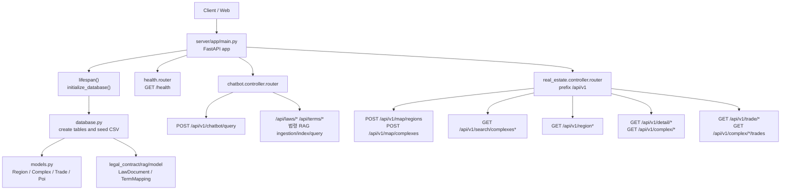

### 초기 설정 포인트

`server/app/main.py`

- FastAPI 앱을 만든다.
- CORS 기본 허용 origin은 `http://localhost:5173`, `http://127.0.0.1:5173`이다.
- 앱 lifespan에서 `initialize_database()`를 호출한다.
- `health`, `chatbot`, `real_estate` 라우터를 붙인다.

`server/app/config.py`

- `.env`는 `load_environment()`에서 한 번만 로드한다.
- pytest 실행 중에는 `.env`를 로드하지 않는다.

`server/app/database.py`

- `DATABASE_URL`이 없으면 기본은 in-memory SQLite다.
- `DATA_IMPORT_DIR`이 없으면 `server/db/import` CSV를 seed로 사용한다.
- `get_session()`은 lazy하게 `ensure_initialized()`를 호출하고 SQLAlchemy session을 yield한다.
- seed 순서는 `regions`, `complexes`, `trades`, `pois`다.
- 법령 RAG의 `LawDocument`, `DailyLegalTermMapping` 계열 테이블은 같은 SQLAlchemy `Base`에 붙지만, 부동산 CSV seed 대상은 아니다. 법령 원문 수집, 파싱, embedding 색인은 `/api/laws/*`, `/api/terms/*` 관리 API 흐름에서 별도로 처리한다.

주요 환경 변수:

| env | 사용 위치 | 의미 |
|---|---|---|
| `DATABASE_URL` | `database.py` | DB 연결 문자열. 없으면 in-memory SQLite |
| `DATA_IMPORT_DIR` | `database.py` | 초기 seed CSV 위치. 없으면 `server/db/import` |
| `CORS_ALLOW_ORIGINS` | `main.py` | 허용할 web origin 목록 |
| `OPENAI_API_KEY` | answer composer, legal RAG embedding, LangChain agent | 답변 LLM, supervisor/specialist agent, 법령 embedding |
| `OPENAI_CHAT_MODEL` | `supervisor.py`, `answer/composer.py` | agent와 answer composer 모델 |
| `CHATBOT_ANSWER_LLM_FAILURE_COOLDOWN_SECONDS` | `answer/composer.py` | 429/quota 오류 후 answer LLM 임시 비활성 시간 |

## 2. 패키지별 책임

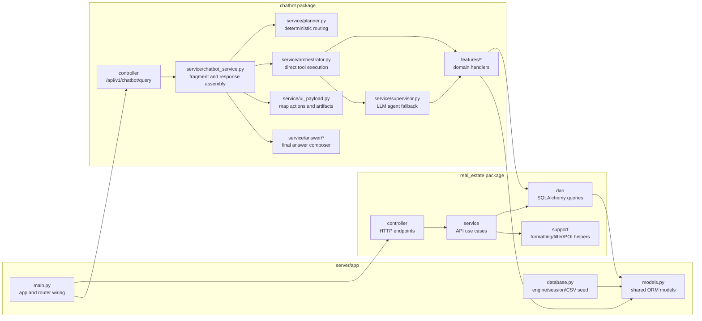

### `real_estate`

일반 API를 담당한다. 챗봇도 내부적으로 이 DAO/helper들을 많이 재사용한다.

| 계층 | 주요 파일 | 역할 |
|---|---|---|
| controller | `real_estate/controller/*.py` | HTTP 요청/응답, status code 처리 |
| service | `real_estate/service/*.py` | 지도 marker, 검색, 상세, 거래 조회 use case |
| dao | `real_estate/dao/*.py` | `Region`, `Complex`, `Trade`, `Poi` DB 조회 |
| support | `real_estate/support/*.py` | 응답 formatting, filter, 거리 계산 |

### `chatbot`

자연어 질문을 처리한다. 크게 두 경로가 있다.

- deterministic path: rule 기반 planner가 곧바로 feature handler를 실행한다.
- supervisor path: deterministic rule로 확정하기 어렵거나 direct 실행에 필요한 slot이 부족한 경우 LLM supervisor가 specialist agent tool을 호출한다.

| 계층 | 주요 파일 | 역할 |
|---|---|---|
| controller | `chatbot/controller/chatbot_controller.py` | `POST /api/v1/chatbot/query` 진입 |
| dto | `chatbot/dto/chatbot_dto.py` | request validation, additive response field 보존 |
| service | `chatbot/service/chatbot_service.py` | fragment split, task execution, response assembly |
| planner | `chatbot/service/planner.py` | signal 기반 plan type 결정 |
| orchestrator | `chatbot/service/orchestrator.py` | plan step 실행, aggregate, fallback |
| supervisor | `chatbot/service/supervisor.py` | LangChain agent, specialist agent tool 호출 |
| tools | `chatbot/service/tools/*.py` | LLM tool wrapper, slot merge |
| features | `chatbot/features/*` | 실제 도메인 handler |
| answer | `chatbot/service/answer/*` | 최종 자연어 답변 생성과 fallback |
| UI payload | `chatbot/service/ui_payload.py` | 지도 이동/action과 chart/list artifact 생성 |

## 3. 일반 부동산 API 흐름

프론트 지도와 상세 패널이 직접 호출하는 API다.

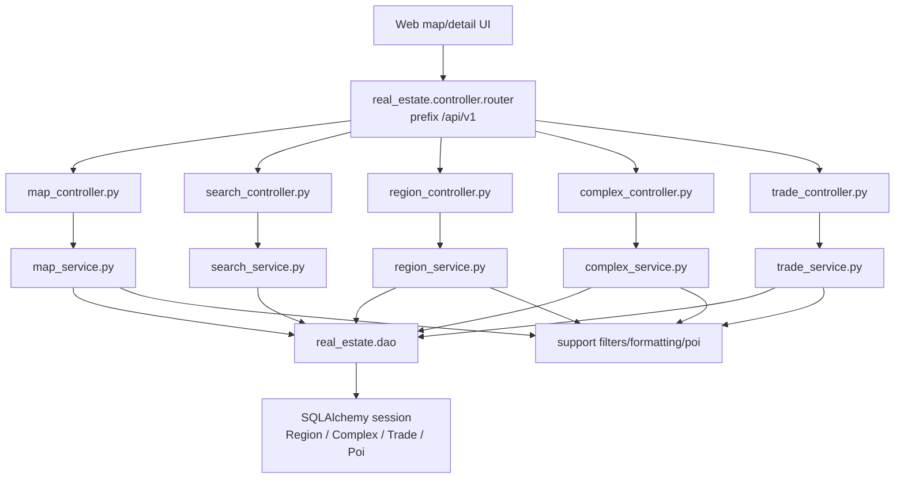

주요 endpoint:

- `POST /api/v1/map/regions`
  - body의 bounds와 `region` 타입을 읽는다.
  - `region`은 `district`, `neighborhood`만 허용한다.
  - 잘못된 region 타입이면 400.
- `POST /api/v1/map/complexes`
  - bounds 안의 단지를 찾고 최신 거래를 붙인다.
  - 가격, 평형, 연식, 세대수 filter를 적용한다.
  - 좌표가 없는 단지는 marker 대상에서 제외된다.
- `GET /api/v1/detail/{parcel_id}`
  - parcel 기준 상세를 반환한다.
  - `complexId`가 있으면 해당 complex를 정확히 연다.
- `GET /api/v1/complex/{complex_id}`
  - 챗봇 지도 action에서 `parcelId`가 없고 `complexId`만 있는 경우 이 detail API를 사용할 수 있다.
- `GET /api/v1/trade/*`, `GET /api/v1/complex/*/trade-trend`
  - 상세 패널의 거래 목록과 월별 시세 흐름에 사용된다.

## 4. 챗봇 API 최상위 흐름

사용자가 챗봇에 질문하면 최종 응답은 다음 구조로 만들어진다.

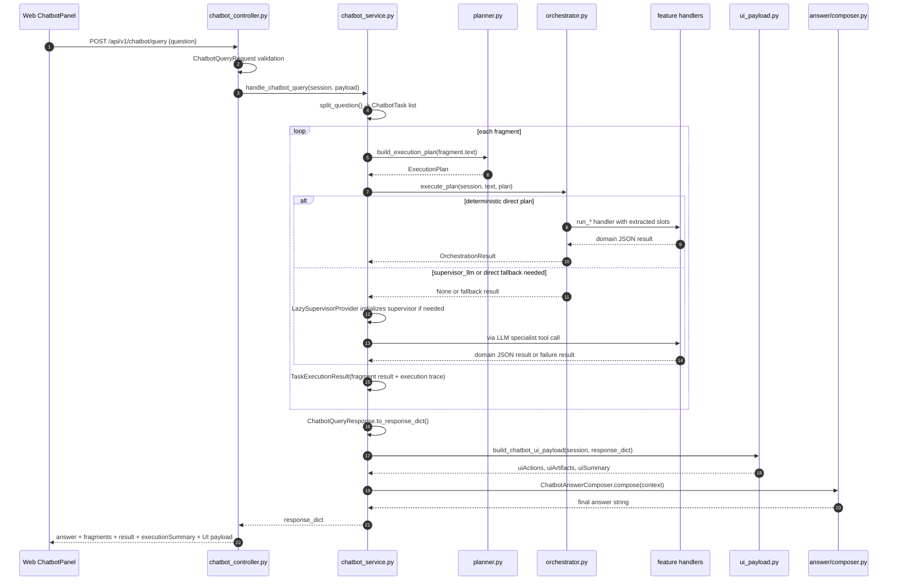

### 응답 조립 순서

`handle_chatbot_query()`의 순서가 중요하다.

1. `question` trim.
2. `LazySupervisorProvider(session)` 준비. 실제 supervisor는 필요할 때만 초기화한다.
3. `split_question(question)`으로 fragment 분리.
4. 각 fragment마다 `execute_task()` 실행.
5. `ChatbotQueryResponse.to_response_dict()`로 기존 JSON 응답 조립.
6. `build_chatbot_ui_payload(session, response_dict)`로 UI payload 추가.
7. `ChatbotAnswerContext.from_response_dict(response_dict)`로 답변 context 생성.
8. `ChatbotAnswerComposer().compose(answer_context)`로 최종 `answer` 생성.
9. 최종 응답 반환.

이 순서 때문에 LLM answer composer는 이미 생성된 `uiSummary`를 보고 "지도에 표시했습니다", "아래 비교 그래프에서 볼 수 있습니다" 같은 말을 자연스럽게 넣을 수 있다.

## 5. 질문 fragment 처리

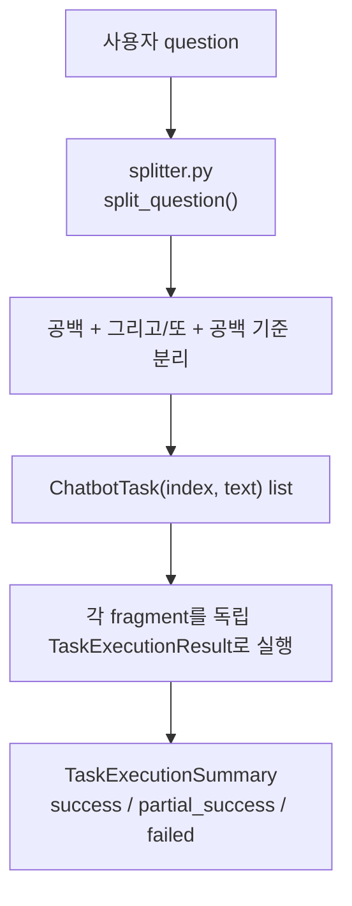

특이점:

- splitter는 복잡한 문장 파서를 쓰지 않는다.
- 현재 분리 기준은 `그리고`, `또`다.
- 각 fragment는 독립적으로 planner를 탄다.
- 하나라도 성공하면 전체 `success=True`이고 일부 실패가 있으면 `status=partial_success`가 된다.

## 6. Planner: tool을 고르는 첫 번째 관문

`planner.py`는 LLM을 호출하기 전에 rule 기반으로 plan을 확정하려고 한다. 이 단계가 성공하면 supervisor agent를 만들지 않고 바로 handler를 실행한다.

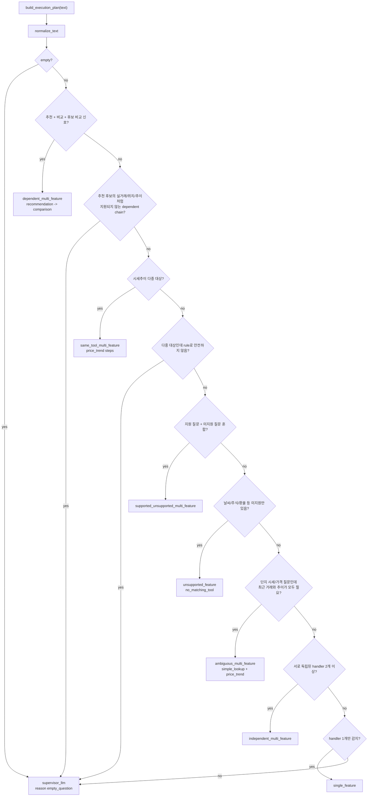

### plan type별 의미

| plan type | 의미 | 대표 예 |
|---|---|---|
| `single_feature` | 하나의 handler로 충분 | `잠실엘스 위치 알려줘` |
| `ambiguous_multi_feature` | 단지 시세처럼 최근 거래와 추이가 모두 필요 | `잠실엘스 시세 알려줘` |
| `dependent_multi_feature` | 앞 결과가 뒤 입력이 됨 | `추천 후보 비교해줘` |
| `independent_multi_feature` | 서로 독립된 여러 근거 | `강남구 추천하고 계약금 규정 알려줘` |
| `same_tool_multi_feature` | 같은 tool을 대상만 바꿔 여러 번 실행 | `강남구랑 서초구 시세 추이 알려줘` |
| `supported_unsupported_multi_feature` | 지원 질문과 미지원 질문이 섞임 | `잠실엘스 위치랑 오늘 날씨 알려줘` |
| `unsupported_feature` | 지원 범위 밖 | `오늘 날씨 알려줘` |
| `supervisor_llm` | rule로 안전하게 실행하기 어려움 | 불명확한 복합 의존 질문 |

### handler 감지 신호

| handler | 주요 신호 |
|---|---|
| `recommendation` | 추천, 권해, 골라, 조건에 맞는 |
| `comparison` | 비교, 차이, 둘 중, 어디가 더, vs |
| `simple_lookup` | 위치, 주소, 실거래, 최근 거래, 최고가, 최저가 |
| `price_trend` | 시세 추이, 가격 흐름, 변화율, 상승률, 하락률, 지역 가격 질문 |
| `legal_contract` | 계약, 법령, 법률, 임대차, 전세, 계약금, 해제, 위약금 |
| `no_matching_tool` | 날씨, 주식, 환율 등 지원 범위 밖 |

## 7. Orchestrator: plan을 실제 handler 실행으로 바꾸는 계층

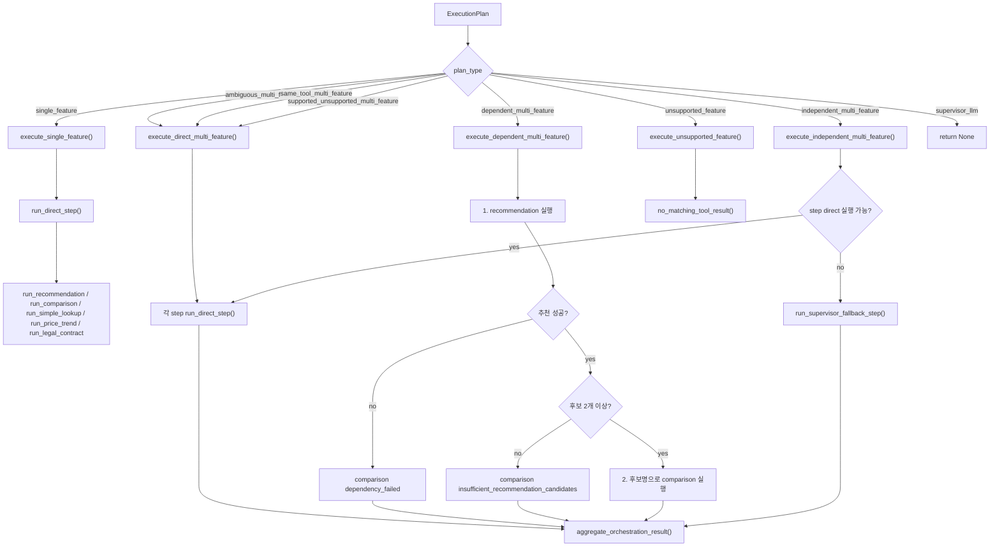

### `run_direct_step()`에서 실제 하는 일

| handler | slot 추출 | 필수 조건 | 실행 함수 |
|---|---|---|---|
| `recommendation` | `extract_recommendation_slots()` | 없음 | `run_recommendation()` |
| `comparison` | `extract_compare_slots()` | 없음. 서비스 내부에서 2개 이상 단지 필요 | `run_comparison()` |
| `simple_lookup` | `extract_simple_lookup_slots()` | `query_type`, `target_name` 필요 | `run_simple_lookup()` |
| `price_trend` | `extract_price_trend_slots()` | `analysis_type`, `target_type`, `target_name` 필요 | `run_price_trend()` |
| `legal_contract` | `extract_legal_contract_slots()` | 없음. RAG 내부에서 embedding 가능 여부 판단 | `run_legal_contract()` |
| `no_matching_tool` | 없음 | 없음 | `no_matching_tool_result()` |

특이점:

- `simple_lookup`, `price_trend`는 필수 slot이 없으면 `None`을 반환한다.
- `independent_multi_feature`에서 direct step이 `None`이면 해당 step만 supervisor fallback을 탄다.
- `single_feature`에서 direct step이 `None`이면 `execute_plan()`이 `None`을 반환하고, `execute_task()`가 전체 supervisor fallback으로 넘어간다.
- `dependent_multi_feature`는 추천이 실패하거나 후보가 부족해도 전체 aggregate result를 만든다. 이때 comparison은 실패 result로 들어간다.

## 8. Supervisor LLM fallback

deterministic plan으로 처리하지 못하거나 direct 실행에 실패한 경우에만 supervisor를 만든다.

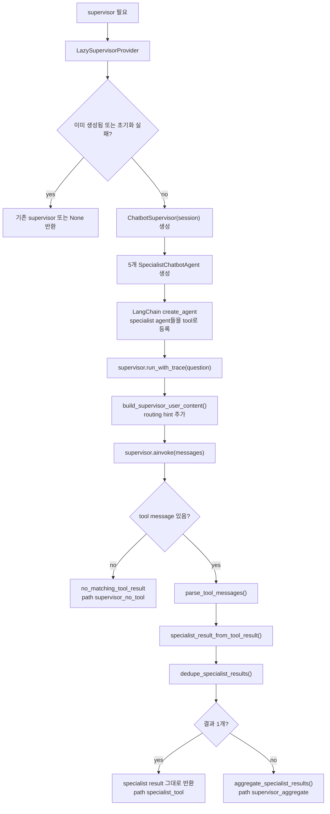

### supervisor가 가진 specialist agent

| specialist agent | 내부 tool | 담당 |
|---|---|---|
| `lookup_agent` | `simple_lookup` | 단지 위치, 주소, 실거래, 최고가 |
| `recommendation_agent` | `recommend_apartments` | 조건 기반 아파트 추천 |
| `comparison_agent` | `compare_apartments` | 둘 이상의 단지 비교 |
| `price_trend_agent` | `analyze_price_trend` | 시세 추이, 변화율, 순위 |
| `legal_contract_agent` | `search_legal_contract` | 계약/법령 근거 검색 |

### LangChain tool wrapper가 slots를 만드는 방식

Supervisor path에서는 LLM이 tool 인자를 직접 채울 수 있지만, 서버는 원문 query에서 한 번 더 deterministic slot을 추출한다. 그 뒤 LLM이 넘긴 명시 인자를 `None`이 아닌 값만 덮어쓴다.

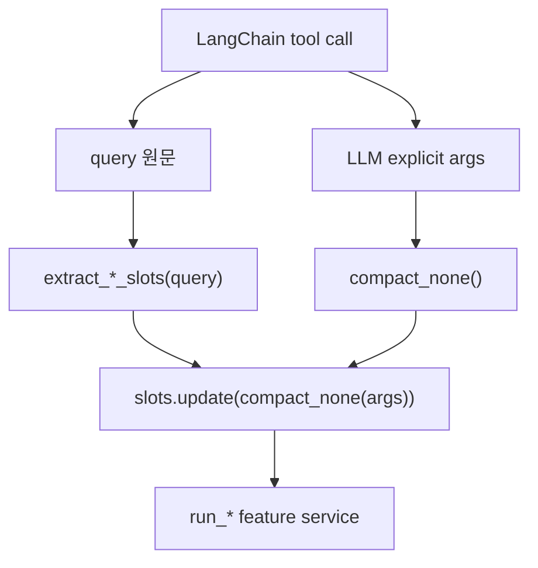

핵심 포인트:

- direct path와 supervisor path가 모두 같은 `run_*` feature service로 모인다.
- tool wrapper는 LLM이 일부 인자를 빼먹어도 query 기반 기본 추출값을 사용한다.
- `price_trend`는 기간 조건이 query에서 이미 추출되면 LLM이 넘긴 `period/start_date/end_date`가 원문 조건을 덮어쓰지 못하게 보호한다.
- `simple_lookup`, `price_trend`처럼 필수 slot이 있는 handler는 orchestrator direct path에서 먼저 검증한다.

### tool 대답이 없을 때

LLM agent가 tool을 호출하지 않으면 `extract_agent_result()` 또는 `extract_supervisor_result_with_trace()`는 `no_matching_tool_result()`를 반환한다.

결과 형태:

```json
{
  "success": false,
  "reason": "no_matching_tool",
  "message": "지원 가능한 질문은 단지 조회, 아파트 추천, 단지 비교, 시세 추이, 계약 법령 질문입니다.",
  "suggestedQuestions": ["잠실엘스 위치 알려줘", "..."]
}
```

이 경우:

- fragment status는 `not_handled`가 된다.
- 전체 fragment 중 성공한 것이 없으면 top-level `success=false`, `status=failed`가 된다.
- 전체 실패이면 최종 `answer`는 OpenAI 답변 LLM 호출 없이 composer 내부에서 `fallback_answer()`로 만들어진다.
- 다른 fragment나 다른 step이 성공한 부분 성공이면 top-level `success=true`, `status=partial_success`가 되고, answer composer는 성공 observation과 실패 observation을 함께 받아 답변한다.
- `uiActions`, `uiArtifacts`는 성공한 부동산 domain result에서만 생성된다. `no_matching_tool` 자체에서는 생성되지 않는다.

### supervisor 초기화/실행 실패

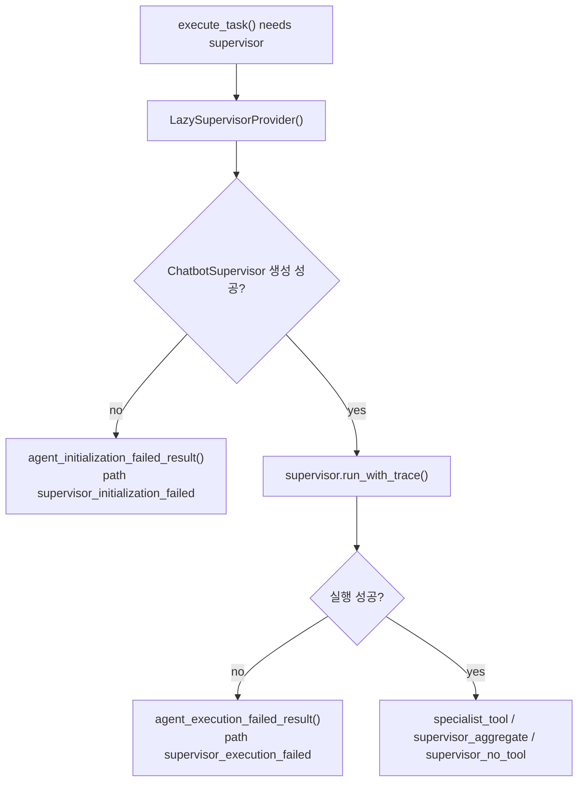

## 9. Domain feature handler 상세

### 9.1 `simple_lookup`

역할:

- 단지 위치 조회
- 단지 실거래 내역
- 단지 최고가/최저가
- 지역 최고가/최저가 거래 랭킹

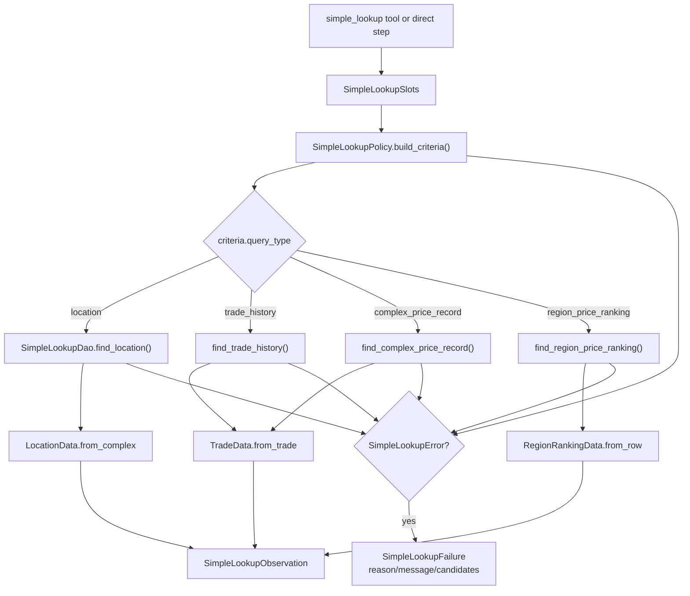

특이점:

- 단지명 resolve는 `name` 정확 일치, `trade_name` 정확 일치, 부분 일치 순서다.
- 여러 단지가 매칭되면 `ambiguous_target`과 candidates를 반환한다.
- 거래가 없으면 `no_result`.
- 지역 랭킹은 raw SQL로 `ROW_NUMBER()`를 사용한다.

### 9.2 `recommendation`

역할:

- 지역, 가격, 역/학교, 신축, 세대수, 평형, 인프라 조건에 맞는 후보 추천

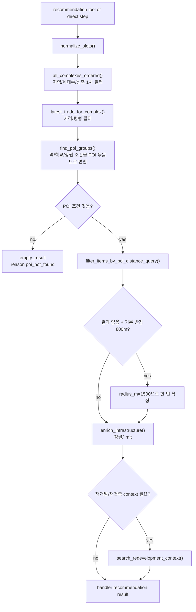

특이점:

- `신축`은 명시 연도가 없으면 기본 `2020년 이후`로 해석된다.
- `근처` 질문은 명시 반경이 없으면 기본 800m, 결과가 없으면 1500m로 한 번 넓힌다.
- 결과 item은 `complexId`, `parcelId`, `latitude`, `longitude`, `unitCnt`, `useDate`, `latestDealAmountText`, `infrastructure`를 포함할 수 있다.

### 9.3 `comparison`

역할:

- 둘 이상의 아파트를 가격, 평형, 평당가, 세대수, 준공연도, 역/학교 거리, 생활편의 기준으로 비교

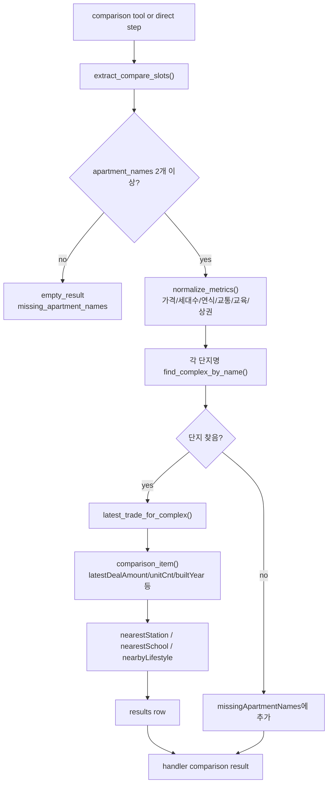

특이점:

- 단지를 일부 못 찾으면 `success=false`이고 `missingApartmentNames`가 채워진다.
- `builtYear`는 `Complex.use_date`의 연도다. UI/답변에서는 "준공연도" 또는 더 정확히 "사용승인연도"로 볼 수 있다.
- 추천 후 후보 비교에서는 recommendation 결과의 `complexName`을 comparison의 `apartment_names`로 넘긴다.

### 9.4 `price_trend`

역할:

- 단지/지역 시세 시계열
- 지역 내 상승률/하락률 ranking

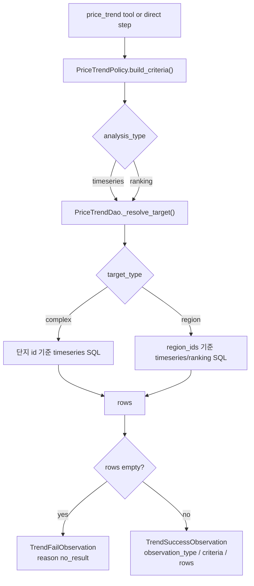

특이점:

- SQLite와 PostgreSQL 날짜 집계 SQL이 다르다.
- PostgreSQL은 `date_trunc`, SQLite는 `substr`, `strftime`을 사용한다.
- ranking은 지역 기준만 지원한다.
- "강남 3구"는 여러 region id로 resolve될 수 있다.

### 9.5 `legal_contract`

역할:

- 계약/법령 질문을 법령 RAG 검색으로 처리한다.

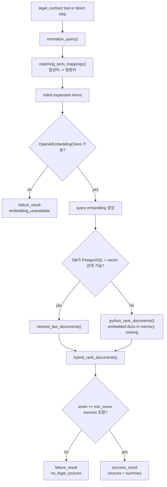

특이점:

- 법령 RAG는 부동산 `Region/Complex/Trade`와 별도의 `LawDocument`, `DailyLegalTermMapping` 테이블을 사용한다.
- embedding client 생성에 실패하면 tool 결과는 실패지만 서버 전체가 죽지는 않는다.
- source에는 법령명, 조문, 본문, score, URL 등이 포함된다. 최종 answer composer는 score/document id 같은 내부 식별자를 노출하지 않도록 prompt로 제한한다.

## 10. 결과 aggregation과 dedupe

여러 tool 또는 specialist 결과가 생기면 공통 aggregation을 탄다.

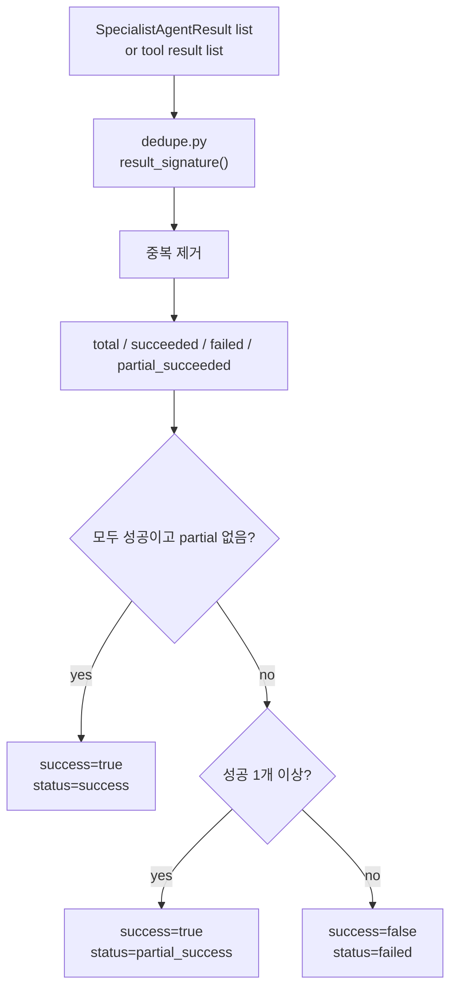

dedupe 기준:

- `simple_lookup`: query type, target, period, limit 중심
- `price_trend`: analysis type, target, period, interval, direction, limit 중심
- `recommendation`: criteria 전체
- `comparison`: apartment names와 metrics
- `legal_contract`: normalized question

## 11. UI payload 생성

`ui_payload.py`는 LLM이 아니라 backend deterministic 로직으로 지도 이동과 시각 자료를 만든다.

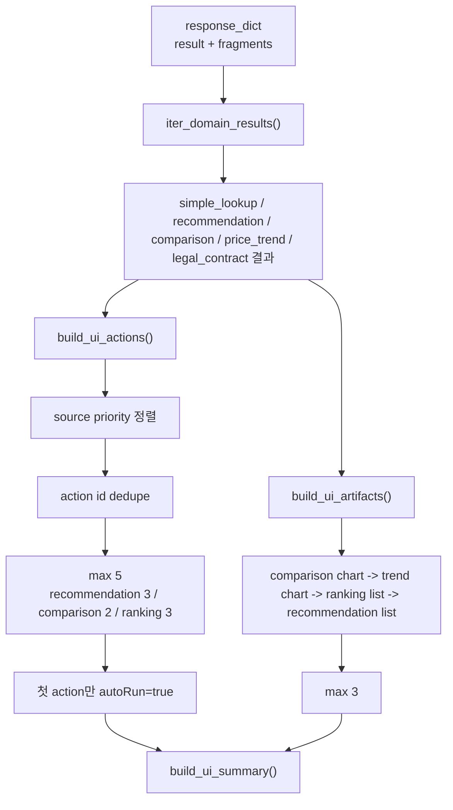

### action 생성 규칙

현재 action type은 `focus_map`이다.

- complex target
  - `target.kind="complex"`
  - 좌표가 있어야 생성된다.
  - `level=2`
  - `openDetail=true`
  - `complexId` 또는 이름 기반 id로 dedupe한다.
- region target
  - `target.kind="region"`
  - `level=7`
  - `openDetail=false`

action 우선순위:

1. `simple_lookup.location`
2. `recommendation.results`
3. `comparison.results`
4. `simple_lookup.trade_history`
5. `simple_lookup.complex_price_record`
6. `price_trend.complex_timeseries`
7. `simple_lookup.region_price_ranking`
8. `price_trend.ranking`
9. `price_trend.region_timeseries`

특이점:

- `legal_contract`와 `no_matching_tool`은 action을 만들지 않는다.
- 추천/비교 결과에 좌표가 있어도 DB로 한 번 더 보강한다.
- trade history처럼 결과 row에 좌표가 없는 경우 `complex_id`로 DB에서 좌표와 parcel을 보강한다.
- 응답당 `autoRun=true`는 하나만 붙는다.

### artifact 생성 규칙

| artifact type | source | 조건 |
|---|---|---|
| `comparison_bar_chart` | comparison results | 비교 대상 2개 이상, numeric metric 1개 이상 |
| `trend_line_chart` | price trend timeseries | point 2개 이상 |
| `ranking_list` | price trend ranking, simple lookup region ranking | row 1개 이상 |
| `recommendation_list` | recommendation results | 추천 item 1개 이상 |

artifact 우선순위:

1. comparison chart
2. trend chart
3. ranking list
4. recommendation list

## 12. 최종 자연어 answer 생성

최종 `answer`는 tool 결과 JSON과 UI 요약을 바탕으로 생성된다. tool 자체의 raw JSON answer는 사용자에게 노출하지 않는다.

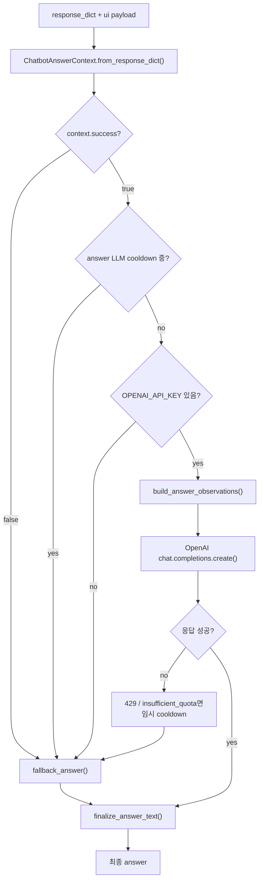

### LLM에 넘기는 데이터

`build_answer_observations()`는 전체 응답을 그대로 넘기지 않고 축약한다.

포함:

- question
- success/status/message
- executionSummary
- successfulObservations
- failedObservations
- compacted single/multiple result
- `uiSummary`
- artifact summary
- rawResponse metadata

제외 또는 축약:

- nested `answer`
- raw `uiActions`
- 좌표 중심의 action JSON
- 너무 긴 rows/sources
- 내부 실행 trace 대부분

### 후처리 규칙

`finalize_answer_text()`는 다음을 보장한다.

1. 공백과 줄바꿈 정리.
2. 위도/경도/latitude/longitude 패턴 제거.
3. 내부 용어 검사.
   - `handler`, `agent`, `tool`, `execution`, `planType`, `dedupe`, `fragment`
4. 금지어가 있으면 fallback answer로 교체.
5. 500자 초과 시 문장 단위 축약.
6. 그래도 길면 497자 + `...`.

## 13. 실패와 부분 성공 시나리오

### A. 지원 범위 밖 질문

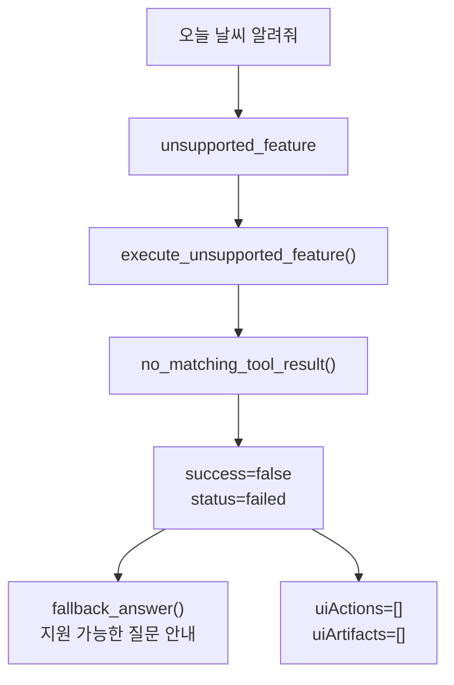

### B. 지원 질문과 미지원 질문이 섞임

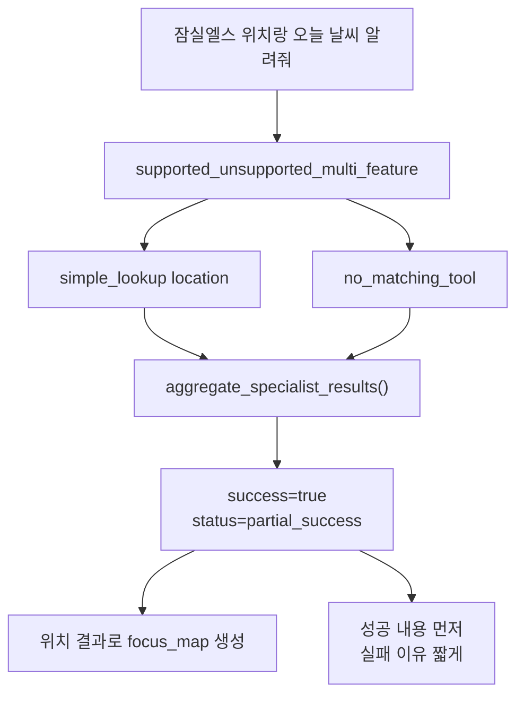

### C. direct step에 필수 slot이 없음

```mermaid
flowchart TD
  Step["simple_lookup or price_trend step"] --> Slots["slot extraction"]
  Slots --> Required{"필수 slot 있음?"}
  Required -- yes --> Handler["domain handler 실행"]
  Required -- no --> Context{"plan 위치"}
  Context -- single_feature --> WholeFallback["execute_plan returns None<br/>execute_task supervisor fallback"]
  Context -- independent_multi_feature --> StepFallback["해당 step만 supervisor fallback"]
```

### D. tool은 호출됐지만 결과가 없음

```mermaid
flowchart TD
  Handler["domain handler"] --> Query["DB/RAG query"]
  Query --> Empty{"결과 없음"}
  Empty -- yes --> FailureResult["success=false<br/>reason no_result or domain reason<br/>message"]
  Empty -- no --> SuccessResult["success=true"]
  FailureResult --> Aggregate["fragment 또는 aggregate status 계산"]
  SuccessResult --> Aggregate
  Aggregate --> SomeSuccess{"성공 결과가 하나라도 있음?"}
  SomeSuccess -- yes --> PartialOrSuccess["partial_success or success"]
  SomeSuccess -- no --> Failed["failed"]
```

### E. 답변 LLM 실패

```mermaid
flowchart TD
  Composer["ChatbotAnswerComposer"] --> OpenAI["OpenAI chat completion"]
  OpenAI --> Error{"예외 발생?"}
  Error -- no --> Finalize["finalize_answer_text()"]
  Error -- yes --> RateLimit{"429 또는 insufficient_quota?"}
  RateLimit -- yes --> Cooldown["answer LLM 임시 비활성화"]
  RateLimit -- no --> Log["logger.exception"]
  Cooldown --> Fallback["fallback_answer()"]
  Log --> Fallback
  Fallback --> Finalize
```

## 14. 최종 응답 field 의미

```json
{
  "success": true,
  "status": "success",
  "question": "잠실엘스 시세 알려줘",
  "fragments": [],
  "result": {},
  "message": "질문을 처리했습니다.",
  "executionSummary": { "total": 1, "succeeded": 1, "failed": 0 },
  "uiActions": [],
  "uiArtifacts": [],
  "uiSummary": {},
  "answer": "..."
}
```

| field | 생성 위치 | 설명 |
|---|---|---|
| `success` | `TaskExecutionSummary` | fragment 중 성공이 하나라도 있는지 |
| `status` | `TaskExecutionSummary` | `success`, `partial_success`, `failed` |
| `fragments` | `TaskExecutionResult.to_fragment_dict()` | fragment별 result와 execution trace |
| `result` | `ChatbotQueryResponse.to_response_dict()` | fragment가 1개면 dict, 여러 개면 list |
| `executionSummary` | `TaskExecutionSummary.to_dict()` | total/succeeded/failed |
| `uiActions` | `build_chatbot_ui_payload()` | 지도 이동/상세 열기 action |
| `uiArtifacts` | `build_chatbot_ui_payload()` | 비교 chart, 시세 chart, ranking/recommendation list |
| `uiSummary` | `build_chatbot_ui_payload()` | answer composer용 UI 요약 |
| `answer` | `ChatbotAnswerComposer.compose()` | 사용자에게 보여줄 최종 자연어 답변 |

## 15. 주요 분기점 요약

| 분기점 | 파일 | 판단 | 결과 |
|---|---|---|---|
| 앱 시작 | `main.py`, `database.py` | lifespan 진입 | DB table 생성, CSV seed |
| 질문 validation | `chatbot_dto.py` | blank question 여부 | 422 또는 service 진입 |
| fragment split | `splitter.py` | `그리고`, `또` | 여러 task로 분리 |
| plan 결정 | `planner.py` | signal과 target 추출 | direct plan 또는 `supervisor_llm` |
| direct 실행 가능성 | `orchestrator.py` | 필수 slot 존재 | handler 실행 또는 fallback |
| 추천 후 비교 | `orchestrator.py` | 추천 성공과 후보 수 | comparison 실행 또는 dependency failure |
| tool 결과 없음 | feature service/dao | DB/RAG 결과 empty | domain failure result |
| supervisor tool 미호출 | `supervisor.py` | tool_messages 없음 | `no_matching_tool_result()` |
| answer LLM 사용 | `answer/composer.py` | success, cooldown, API key | LLM answer 또는 fallback |
| UI action 생성 | `ui_payload.py` | domain result 성공, 좌표 존재 | `focus_map` 생성 |
| artifact 생성 | `ui_payload.py` | chart/list 조건 충족 | 최대 3개 artifact |

## 16. 유지보수 시 주의할 점

1. Planner rule을 추가하면 orchestrator direct 실행 가능성도 같이 확인해야 한다.
   - plan이 생겼지만 필수 slot이 없으면 supervisor fallback으로 넘어간다.
2. feature result schema를 바꾸면 세 군데를 같이 확인해야 한다.
   - answer observation compaction
   - UI payload extractor
   - frontend normalizer/rendering
3. 가격 단위는 DB에서 `만원`이다.
   - LLM prompt도 숫자 가격을 만원으로 해석하라고 제한한다.
   - 가능하면 feature result에서 `latestDealAmountText` 같은 display text를 함께 제공하는 것이 안전하다.
4. 좌표는 UI action에는 필요하지만 answer LLM에는 직접 넘기지 않는 것이 원칙이다.
5. legal RAG는 OpenAI embedding key와 embedding된 법령 데이터가 있어야 성공한다.
   - embedding client가 없으면 failure result를 반환하고 서버는 정상 동작한다.
6. `ChatbotQueryResponse` DTO는 `extra="allow"`다.
   - 신규 additive field가 response model에서 잘리지 않게 하기 위한 선택이다.
7. `uiActions`는 자동 실행 부작용이 있으므로 backend 우선순위와 dedupe가 중요하다.
   - 응답당 `autoRun=true`는 첫 action 하나뿐이다.

## 17. 자체 리뷰 반영 사항

문서 초안 작성 후 다음 기준으로 다시 확인했다.

- controller에서 service, service에서 feature handler까지의 호출 방향이 실제 코드와 맞는지 확인했다.
- deterministic planner와 supervisor fallback이 섞이는 지점을 별도 분기로 분리했다.
- "tool 대답이 없을 때"를 세 가지로 구분했다.
  - LLM이 tool을 호출하지 않음
  - direct step에 필수 slot이 없음
  - tool은 호출됐지만 DB/RAG 결과가 없음
- 최종 자연어 답변이 tool JSON에서 바로 나오는 것이 아니라 `uiSummary`가 붙은 뒤 answer composer를 타는 순서를 명시했다.
- 일반 `real_estate` API와 챗봇 내부 feature handler가 같은 DB/DAO/support 계층을 공유한다는 점을 다이어그램에 반영했다.
