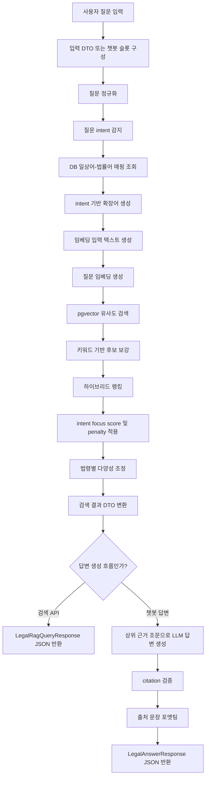

# 법령 RAG 질문-답변 처리 흐름

작성일: 2026-06-25

이 문서는 `app/chatbot/features/legal_contract/rag` 패키지에서 법률 질문이 입력된 뒤 검색 근거를 찾고, LLM 답변을 생성하고, JSON 응답으로 반환하기까지의 최신 흐름을 정리한다.

기준 코드 위치:

- 검색 API: `POST /api/laws/query`
- 챗봇 답변 흐름: `run_legal_contract() -> LegalRagQueryService.query() -> LegalAnswerService.answer()`
- 검색 서비스: `app/chatbot/features/legal_contract/rag/service/query_service.py`
- 답변 서비스: `app/chatbot/features/legal_contract/rag/service/answer_service.py`

## 기존 문서 대비 변경 사항

기존 `docs/data/legal_rag_answerflow.md`와 현재 코드 구조를 비교하면 다음 내용이 달라졌다.

| 항목 | 기존 문서 | 현재 코드 |
|---|---|---|
| 기본 검색 개수 | `topK = 5` | `topK = 7` |
| 답변 생성 근거 수 | `MAX_ANSWER_SOURCES = 5` | `MAX_ANSWER_SOURCES = 7` |
| 조문 본문 최대 길이 | `MAX_SOURCE_CONTENT_CHARS = 6000` | `MAX_SOURCE_CONTENT_CHARS = 12000` |
| 검색 확장 방식 | DB 일상어-법률어 매핑 중심 | DB 매핑 + 질문 의도 기반 확장어 |
| 질문 의도 분류 | 없음 | `query_intent.py`에서 intent 감지 |
| 의도별 확장어 | 없음 | `query_expansion.py`에서 intent별 확장어 추가 |
| broad 질문 처리 | 일반 검색과 동일 | broad일 때 후보군을 더 넓게 조회 |
| 랭킹 방식 | `vectorScore + keywordScore` 중심 | vector + keyword + intent focus - penalty |
| 특수 조문 처리 | 없음 | 일반 질문에서는 일부 특수 조문 감점, 특수 질문에서는 감점 해제 |
| 답변 출처 형식 | `출처` 목록 + URL/시행일 | `근거는 ~~~법의 ~~를 참조했습니다.` |
| LLM 근거 문장 중복 처리 | 없음 | 모델이 쓴 `근거는 ...` 문장을 제거 후 서버가 다시 붙임 |

## 테스트 질문 세트

현재 QA runner 검증에는 기존 20문항과 추가 10문항을 합친 30문항을 사용했다.

### 기존 20문항

1. 아파트 매매 시 알아야 할 법률이 있을까?
2. 아파트 매매 시 세금 책정 관련 법을 알려줘.
3. 매매 계약서에서 중요하게 볼 부분은 어디야?
4. 집을 살 때 알아야 할 법이 있을까?
5. 아파트 매매계약 후 신고해야 하는 게 있어?
6. 세입자 있는 집을 사도 괜찮아?
7. 명의 이전은 어떤 법과 관련 있어?
8. 계약금을 냈는데 계약을 취소할 수 있어?
9. 부모님이 돈을 보태주면 문제가 있어?
10. 등기부에서 빚 잡힌 집인지 보려면 뭘 봐야 해?
11. 아파트 매매계약은 법적으로 언제 성립해?
12. 매도인이 계약금을 받았는데 계약을 해제하려면 어떻게 해야 해?
13. 부동산 거래 신고는 누가 해야 해?
14. 공인중개사가 거래계약서를 거짓으로 작성하면 안 된다는 법이 있어?
15. 부동산 등기부에는 어떤 권리를 등기할 수 있어?
16. 소유권 이전등기는 어떤 법과 관련 있어?
17. 토지거래허가구역에서 집을 사려면 허가가 필요해?
18. 부동산 거래 신고필증은 등기와 어떤 관련이 있어?
19. 매매대금을 지급하기로 한 계약도 매매로 볼 수 있어?
20. 아파트 구분소유자는 집합건물법과 관련이 있어?

### 추가 10문항

21. 아파트 살 때 계약 전에 꼭 확인해야 할 법적 사항은 뭐야?
22. 등기부등본에서 근저당 말고도 위험한 권리가 있어?
23. 전세 낀 아파트를 사면 보증금은 누가 돌려줘야 해?
24. 매수인이 잔금 치르기 전에 계약을 깨면 계약금은 어떻게 돼?
25. 매도인이 중도금까지 받은 뒤 계약금을 두 배로 주고 해제할 수 있어?
26. 소유권 이전등기할 때 매수인과 매도인이 같이 신청해야 해?
27. 아파트 지분 일부만 넘길 때 등기는 어떻게 해?
28. 부동산매매업자가 아파트를 팔 때 세금 계산은 어떻게 해?
29. 공인중개사가 집 상태나 권리관계를 설명해야 하는 법이 있어?
30. 집값을 실제보다 낮게 계약서에 쓰면 문제가 있어?

## 전체 흐름



## 1. 입력 DTO

법령 근거 검색 API 입력 DTO는 `app/chatbot/features/legal_contract/rag/dto/query.py`의 `LegalRagQueryRequest`다.

현재 위치:

- `LegalRagQueryRequest`: `app/chatbot/features/legal_contract/rag/dto/query.py:6`
- `top_k`: `app/chatbot/features/legal_contract/rag/dto/query.py:8`

```python
class LegalRagQueryRequest(BaseModel):
  question: str = Field(min_length=1)
  top_k: int = Field(default=7, alias="topK", ge=1, le=20)
```

| 필드 | 타입 | 기본값 | 의미 |
|---|---:|---:|---|
| `question` | `str` | 없음 | 사용자가 입력한 법률 질문 |
| `topK` | `int` | 7 | 최종 반환할 검색 근거 조문 수 |

기존 문서의 `topK=5`는 현재 코드와 다르며, 현재 기본값은 7이다.

## 2. 질문 정규화

검색 서비스 시작점은 `LegalRagQueryService.query()`다.

현재 위치:

- `LegalRagQueryService.query()`: `app/chatbot/features/legal_contract/rag/service/query_service.py:37`
- `normalize_query()`: `app/chatbot/features/legal_contract/normalization.py:13`

정규화는 Unicode NFC, 문장부호 정리, 소문자화, 연속 공백 축소, 앞뒤 공백 제거를 수행한다.

예시:

```text
"계약금을 냈는데, 계약을 취소할 수 있어?"
-> "계약금을 냈는데 계약을 취소할 수 있어"
```

## 3. 질문 Intent 감지

현재 구조에서 정규화 다음 단계는 질문 intent 감지다. 이 단계는 기존 문서에는 없던 신규 흐름이다.

현재 위치:

- `LegalQueryIntent`: `app/chatbot/features/legal_contract/rag/service/query_intent.py:6`
- `INTENT_KEYWORDS`: `app/chatbot/features/legal_contract/rag/service/query_intent.py:20`
- `BROAD_KEYWORDS`: `app/chatbot/features/legal_contract/rag/service/query_intent.py:53`
- `detect_query_intents()`: `app/chatbot/features/legal_contract/rag/service/query_intent.py:67`
- `should_add_broad_intent()`: `app/chatbot/features/legal_contract/rag/service/query_intent.py:83`

현재 intent 종류:

| intent | 의미 |
|---|---|
| `BROAD` | 넓은 생활법률 질문 |
| `TAX` | 세금, 과세, 취득세, 양도소득세 |
| `CONTRACT` | 계약, 계약금, 해제, 성립 |
| `CHECKLIST` | 계약서 확인, 중요 항목, 특약 |
| `PRE_CONTRACT_CHECK` | 계약 전 확인사항 |
| `REGISTRATION` | 명의 이전, 등기, 소유권 이전 |
| `LEASE` | 세입자, 전세, 보증금, 대항력 |
| `BROKER` | 공인중개사, 중개, 설명의무 |
| `RISK` | 근저당, 압류, 가압류, 위험 권리 |
| `FALSE_PRICE` | 다운계약, 허위 거래금액 |
| `GENERAL` | 별도 intent가 감지되지 않은 일반 질문 |

예시:

```text
"전세 낀 아파트를 사면 보증금은 누가 돌려줘야 해?"
-> LEASE

"집값을 실제보다 낮게 계약서에 쓰면 문제가 있어?"
-> CHECKLIST, FALSE_PRICE

"집을 살 때 알아야 할 법이 있을까?"
-> BROAD
```

주의할 점:

- `RISK` intent가 감지된 질문에는 broad 확장을 붙이지 않는다.
- 등기 위험처럼 이미 좁은 확인 대상이 있는 질문도 broad로 과확장하지 않는다.

## 4. 확장어 생성

확장어는 두 경로에서 만들어진다.

1. DB의 `daily_legal_term_mappings`
2. intent 기반 확장어

현재 위치:

- `LegalRagQueryDao.matching_term_mappings()`: `app/chatbot/features/legal_contract/rag/dao/query_dao.py`
- `INTENT_EXPANSION_TERMS`: `app/chatbot/features/legal_contract/rag/service/query_expansion.py:7`
- `BROAD_EXPANSION_TERMS`: `app/chatbot/features/legal_contract/rag/service/query_expansion.py:96`
- `build_intent_expansion_terms()`: `app/chatbot/features/legal_contract/rag/service/query_expansion.py:116`

`query_service.py`에서는 두 확장어를 합친다.

```python
db_expanded_terms = unique_terms([mapping.legal_term for mapping in mappings])
expanded_terms = unique_terms(db_expanded_terms + build_intent_expansion_terms(intents))
```

대표 확장 예시:

| 생활어/의도 | 확장어 예시 |
|---|---|
| 전세 낀 집 | 임차인, 임대차, 대항력, 임차주택의 양수인, 임대인의 지위 승계, 보증금 반환 |
| 계약 전 확인 | 중개대상물 확인 설명, 권리관계, 등기사항증명서, 거래 또는 이용 제한 |
| 다운계약 | 실제 거래가격, 거짓 신고, 거래금액 거짓 기재, 부동산 거래의 신고 |
| 등기부 위험 | 처분의 제한, 가등기, 압류, 가압류, 가처분, 임차권등기 |
| 세금 | 취득세, 양도소득세, 증여세, 과세표준, 세율 |

## 5. 임베딩 입력 텍스트 생성

임베딩 입력 텍스트는 `build_query_embedding_text()`가 만든다.

현재 위치:

- `build_query_embedding_text()`: `app/chatbot/features/legal_contract/rag/service/query_text.py`

형식:

```text
사용자 질문: {normalized_question}
검색 확장어: {expanded_terms}
```

이후 `OpenAIEmbeddingClient`로 질문 임베딩을 생성한다.

## 6. 벡터 유사도 검색

벡터 검색은 `LegalRagQueryDao.nearest_law_documents()`가 수행한다.

PostgreSQL에서는 pgvector의 cosine distance를 사용하고, 테스트 환경에서 PostgreSQL이 아니면 `python_rank_documents()`가 Python cosine similarity fallback 역할을 한다.

현재 위치:

- `nearest_law_documents()`: `app/chatbot/features/legal_contract/rag/dao/query_dao.py`
- `python_rank_documents()`: `app/chatbot/features/legal_contract/rag/service/query_ranking.py`

검색 후보 개수:

- 기본 `DEFAULT_CANDIDATE_K = 70`
- 일반 질문: `max(70, top_k * 10)`
- `BROAD` 질문: `max(candidate_k, top_k * 20)`

현재 위치:

- `DEFAULT_TOP_K = 7`: `app/chatbot/features/legal_contract/rag/service/query_service.py:21`
- `DEFAULT_CANDIDATE_K = 70`: `app/chatbot/features/legal_contract/rag/service/query_service.py:23`
- 일반 후보군 계산: `app/chatbot/features/legal_contract/rag/service/query_service.py:65`
- broad 후보군 확대: `app/chatbot/features/legal_contract/rag/service/query_service.py:67`

중요한 점:

- broad 질문에서도 카테고리별 문서를 강제로 넣지는 않는다.
- 대신 후보군을 넓히고 이후 약한 재정렬을 적용한다.

## 7. 키워드 후보 보강

키워드 후보는 `LegalRagQueryDao.keyword_law_documents()`가 조회한다.

검색 대상 필드:

- `law_name`
- `article_title`
- `content`

검색 용어:

```python
primary_terms + expanded_terms
```

이 단계에서 원문 질문 토큰, DB 확장어, intent 확장어가 함께 후보군 조회에 쓰인다.

## 8. 하이브리드 랭킹

최종 랭킹은 `hybrid_rank_documents()`가 수행한다.

현재 위치:

- `hybrid_rank_documents()`: `app/chatbot/features/legal_contract/rag/service/query_ranking.py:154`
- `document_keyword_score()`: `app/chatbot/features/legal_contract/rag/service/query_ranking.py:238`
- `document_intent_focus_score()`: `app/chatbot/features/legal_contract/rag/service/query_ranking.py:286`
- `special_context_penalty()`: `app/chatbot/features/legal_contract/rag/service/query_ranking.py:338`
- `broad_low_value_penalty()`: `app/chatbot/features/legal_contract/rag/service/query_ranking.py:354`
- `diversify_ranked_documents()`: `app/chatbot/features/legal_contract/rag/service/query_ranking.py:190`

현재 점수 구조:

```text
score = min(1.0, vectorScore + keywordScore + intentFocusScore) - penalty
```

실제 응답에서는 `keywordScore` 필드에 기본 keyword score와 intent focus score가 합산되어 표시된다.

주요 상수:

```python
MAX_KEYWORD_SCORE = 0.25
MAX_PRIMARY_KEYWORD_SCORE = 0.20
MAX_EXPANDED_KEYWORD_SCORE = 0.04
MAX_INTENT_FOCUS_SCORE = 0.08
BROAD_LOW_VALUE_PENALTY = 0.06
SPECIAL_CONTEXT_PENALTY = 0.04
TAX_SPECIAL_CONTEXT_PENALTY = 0.07
REGISTRATION_SPECIAL_CONTEXT_PENALTY = 0.08
```

### 8.1 키워드 점수

필드별 기본 가산점:

| 위치 | 기본 가산점 |
|---|---:|
| `law_name` | 0.12 |
| `article_title` | 0.10 |
| `content` | 0.04 |

`primary_terms`는 기본 가중치 1.0을 사용한다. 다만 `등기부`처럼 신호가 약한 용어는 낮은 가중치를 사용한다.

`expanded_terms`는 기본 가중치 0.15를 사용하며, `취득세`, `양도소득세`, `소유권 이전등기`, `대항력`, `저당권` 등 높은 신호의 확장어는 0.30을 사용한다.

### 8.2 Intent Focus Score

intent focus score는 질문 의도에 맞는 조문이 벡터 점수만으로 밀리는 문제를 완화하기 위한 약한 보정이다.

예시:

| intent | focus 대상 예시 |
|---|---|
| `BROAD` | 부동산 거래의 신고, 거래가액과 매매목록, 중개대상물, 대항력 |
| `CHECKLIST` | 거래계약서의 작성, 매매의 의의, 중개대상물, 해약금 |
| `PRE_CONTRACT_CHECK` | 중개대상물의 확인, 등기사항증명서, 권리관계 |
| `LEASE` | 대항력, 임차주택의 양수인, 임대인의 지위 승계, 보증금 회수 |
| `RISK` | 등기할 수 있는 권리, 처분의 제한, 가등기, 저당권 등기사항 |
| `FALSE_PRICE` | 실제 거래가격, 거짓 신고, 거래계약서의 작성 |
| `TAX` | 취득세, 양도소득세, 양도소득 |

### 8.3 Penalty

penalty는 일반 질문에서 특수 조문이 과도하게 상위에 오는 문제를 완화한다.

예시:

- 일반 세금 질문에서 `부동산매매업자에 대한 세액 계산의 특례`는 감점
- 사용자가 `부동산매매업자`를 직접 말하면 감점 해제
- 일반 소유권 이전등기 질문에서 `소유권의 일부이전`류는 감점
- 사용자가 `지분`, `일부 이전`을 말하면 감점 해제
- broad 질문에서 `정의`, `자료 등 종합관리`, `부동산 등의 평가` 같은 낮은 가치 조문은 감점

### 8.4 법령 다양성 조정

`diversify_ranked_documents()`는 같은 법령의 조문이 상위 결과를 과도하게 독점하지 않도록 조정한다.

기본 규칙:

- 같은 `law_name`은 상위 결과에서 최대 2개까지 우선 허용
- 단, 다른 법령 후보가 충분히 경쟁력 있을 때만 같은 법령 문서를 뒤로 미룬다
- 점수 차이가 너무 크면 관련성 높은 같은 법령 문서를 유지한다

## 9. 검색 결과 DTO

검색 결과는 `source_item()`을 통해 `LegalSourceResponse` 형태로 변환된다.

현재 위치:

- `LegalRagQueryResponse`: `app/chatbot/features/legal_contract/rag/dto/query.py:26`
- `source_item()`: `app/chatbot/features/legal_contract/rag/service/query_response.py`

주요 응답 필드:

| 필드 | 의미 |
|---|---|
| `expandedTerms` | DB 매핑 + intent 기반 확장어 |
| `sources` | 최종 검색 근거 조문 목록 |
| `score` | 최종 랭킹 점수 |
| `vectorScore` | 임베딩 유사도 점수 |
| `keywordScore` | 키워드 점수 + intent focus score |

검색 결과는 `DEFAULT_MIN_SCORE = 0.45` 이상인 문서만 source로 반환된다.

## 10. 챗봇 답변 생성 흐름

챗봇에서 법률 질문으로 라우팅되면 다음 순서로 처리된다.

1. 원문 질문을 슬롯에 보관한다.
2. 정규화 질문으로 검색을 수행한다.
3. 검색 결과의 `expandedTerms`를 슬롯에 저장한다.
4. 원문 질문과 검색 결과를 `LegalAnswerService.answer()`에 전달한다.

중요한 점:

- 검색은 정규화 질문 기준으로 수행한다.
- 최종 답변은 사용자가 입력한 원문 질문 기준으로 생성한다.

## 11. 답변 생성 프롬프트

답변 프롬프트는 `answer_prompt.py`에서 구성한다.

현재 위치:

- `MAX_ANSWER_SOURCES = 7`: `app/chatbot/features/legal_contract/rag/service/answer_prompt.py:7`
- `MAX_SOURCE_CONTENT_CHARS = 12000`: `app/chatbot/features/legal_contract/rag/service/answer_prompt.py:8`
- `SYSTEM_PROMPT`: `app/chatbot/features/legal_contract/rag/service/answer_prompt.py:10`
- `build_legal_answer_messages()`: `app/chatbot/features/legal_contract/rag/service/answer_prompt.py:59`

프롬프트 핵심 규칙:

- 대한민국 아파트와 주택의 부동산 매매 질문으로 해석한다.
- 제공된 법령 조문만 근거로 답변한다.
- 근거에 없는 사실, 판례, 관행, 절차, 결론을 만들지 않는다.
- 질문의 핵심 의도와 무관한 조문만 있으면 답하지 않는다.
- 일반 사용자가 이해할 수 있는 쉬운 용어로 작성한다.
- `answer` 본문은 500자 이내로 작성한다.
- 모델은 출처 목록, URL, 시행일, documentId, `근거는` 문장을 직접 쓰지 않는다.
- 답변에 실제로 사용한 근거의 `documentId`만 `citedDocumentIds`에 포함한다.

LLM context에 포함되는 source 필드:

| 필드 | 의미 |
|---|---|
| `documentId` | 검색된 조문 문서 ID |
| `lawName` | 법령명 |
| `articleNo` | 조문 번호 |
| `articleTitle` | 조문 제목 |
| `paragraphNo` | 항/호 번호 |
| `content` | 조문 내용, 최대 12000자 |

## 12. LLM 구조화 출력

답변 생성기는 `OpenAILegalAnswerGenerator`다.

현재 위치:

- `DEFAULT_ANSWER_MODEL = "gpt-5.5"`: `app/chatbot/features/legal_contract/rag/service/answer_generator.py:12`
- `OpenAILegalAnswerGenerator`: `app/chatbot/features/legal_contract/rag/service/answer_generator.py:44`
- 모델 선택: `app/chatbot/features/legal_contract/rag/service/answer_generator.py:52`

`OPENAI_CHAT_MODEL` 환경변수가 있으면 기본 모델 대신 해당 값을 사용한다.

LLM 응답은 JSON schema로 강제된다.

```json
{
  "answer": "string 또는 null",
  "citedDocumentIds": [573],
  "status": "answered 또는 insufficient_evidence"
}
```

## 13. Citation 검증과 출처 포맷팅

LLM이 반환한 `citedDocumentIds`는 그대로 신뢰하지 않는다. 검색 결과에 실제 존재하는 documentId만 남긴다.

현재 위치:

- `LegalCitation`: `app/chatbot/features/legal_contract/rag/dto/answer.py:24`
- `LegalAnswerResponse`: `app/chatbot/features/legal_contract/rag/dto/answer.py:36`
- `strip_model_written_references()`: `app/chatbot/features/legal_contract/rag/service/answer_response.py:39`
- `answer_with_citations()`: `app/chatbot/features/legal_contract/rag/service/answer_response.py:43`

검증 규칙:

- 검색 결과에 없는 documentId는 제거한다.
- 중복 documentId는 한 번만 사용한다.
- 유효한 citation이 하나도 없으면 답변 실패로 처리한다.
- 모델이 답변 본문에 직접 작성한 `근거는 ...를 참조했습니다.` 문장은 제거한다.
- 서버가 검증된 citation만 이용해 출처 문장을 다시 붙인다.

최종 출처 문장 형식:

```text
근거는 민법의 제565조(해약금)를 참조했습니다.
```

여러 citation을 사용하면 쉼표로 연결된다.

```text
근거는 부동산 거래신고 등에 관한 법률의 제3조(부동산 거래의 신고), 부동산등기규칙의 제124조(거래가액과 매매목록)를 참조했습니다.
```

## 14. 최종 답변 DTO

최종 응답 DTO는 `LegalAnswerResponse`다.

현재 위치:

- `LegalAnswerResponse`: `app/chatbot/features/legal_contract/rag/dto/answer.py:36`

주요 필드:

| 필드 | 의미 |
|---|---|
| `handler` | `legal_contract` |
| `success` | 답변 성공 여부 |
| `question` | 원문 질문 |
| `expandedTerms` | 검색 확장어 |
| `answer` | 최종 답변 본문과 근거 문장 |
| `answerStatus` | `answered`, `insufficient_evidence`, `generation_failed` |
| `citations` | 검증된 citation 목록 |
| `sources` | 검색에 사용된 근거 조문 목록 |
| `retrievalScore` | 최상위 검색 점수 |
| `reason` | 실패 사유 |
| `message` | 사용자 메시지 |

## 15. 성공 응답 예시

```json
{
  "handler": "legal_contract",
  "success": true,
  "question": "계약금을 냈는데 계약을 취소할 수 있어?",
  "expandedTerms": ["해약금", "계약 해제"],
  "answer": "매매계약에서 계약금을 준 경우, 다른 약정이 없고 아직 이행에 착수하기 전이라면 매수인은 계약금을 포기하고 계약을 해제할 수 있습니다. 반대로 계약금을 받은 쪽은 그 두 배를 돌려주고 해제할 수 있습니다.\n\n근거는 민법의 제565조(해약금)를 참조했습니다.",
  "answerStatus": "answered",
  "citations": [
    {
      "documentId": 573,
      "lawName": "민법",
      "articleNo": "제565조",
      "articleTitle": "해약금",
      "paragraphNo": "",
      "sourceUrl": "https://...",
      "effectiveDate": "2026-06-22"
    }
  ],
  "sources": [
    {
      "documentId": 573,
      "lawId": "001706",
      "lawName": "민법",
      "articleNo": "제565조",
      "articleTitle": "해약금",
      "paragraphNo": "",
      "content": "매매의 당사자 일방이 계약 당시에 금전 기타 물건을 계약금...",
      "score": 0.712345,
      "vectorScore": 0.612345,
      "keywordScore": 0.1,
      "sourceUrl": "https://...",
      "effectiveDate": "2026-06-22"
    }
  ],
  "retrievalScore": 0.712345,
  "reason": null,
  "message": "검색된 법령 근거를 바탕으로 답변했습니다."
}
```

## 16. 실패 응답 예시

검색 근거 부족:

```json
{
  "handler": "legal_contract",
  "success": false,
  "question": "부동산 매매와 관련 없는 질문",
  "expandedTerms": [],
  "answer": null,
  "answerStatus": "insufficient_evidence",
  "citations": [],
  "sources": [],
  "retrievalScore": null,
  "reason": "no_legal_sources",
  "message": "답변을 생성할 충분한 법령 근거를 찾지 못했습니다."
}
```

LLM 생성 실패:

```json
{
  "handler": "legal_contract",
  "success": false,
  "question": "계약금을 냈는데 계약을 취소할 수 있어?",
  "expandedTerms": ["해약금"],
  "answer": null,
  "answerStatus": "generation_failed",
  "citations": [],
  "sources": [],
  "retrievalScore": 0.712345,
  "reason": "generation_failed",
  "message": "법률 답변을 생성하지 못했습니다."
}
```
