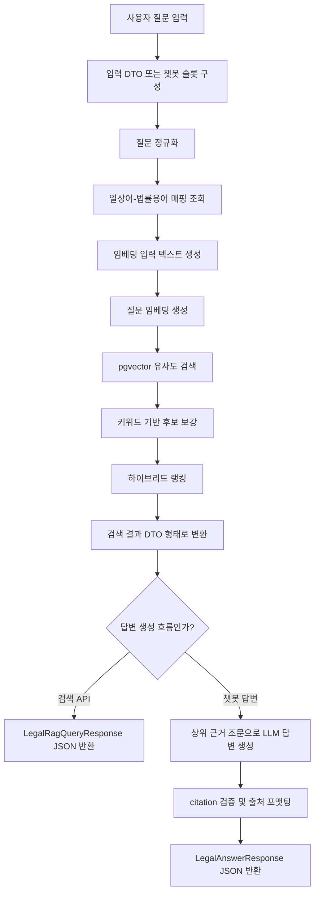

# 법령 RAG 질문-답변 처리 흐름

이 문서는 `app/chatbot/features/legal_contract/rag` 패키지에서 법률 질문이 입력된 뒤 법령 근거 검색, 답변 생성, JSON 응답 반환까지 이어지는 흐름을 설명한다. 대상 흐름은 두 가지다.

- 법령 근거 검색 API: `POST /api/laws/query`
- 챗봇 법률 답변 흐름: `run_legal_contract() -> LegalRagQueryService -> LegalAnswerService`

## 테스트 질문

아래 질문은 QA 결과 문서에서 추출한 테스트 질문이다. 답변 흐름 검증 시 검색, 랭킹, 답변 생성 결과를 같은 질문 세트로 비교한다.

1. 30억 아파트 매매 시 알아야 할 법률이 있을까?
2. 아파트 매매 시 세금 책정 관련 법을 알려줘.
3. 매매 계약서에서 중요하게 볼 부분은 어디야?
4. 집을 살 때 알아야 할 법이 있을까?
5. 아파트 매매계약 후 신고해야 하는 게 있어?
6. 세입자 있는 집을 사도 괜찮아?
7. 명의 이전은 어떤 법과 관련 있어?
8. 계약금을 냈는데 계약을 취소할 수 있어?
9. 부모님이 돈을 보태주면 문제가 있어?
10. 등기부에서 빚 잡힌 집인지 보려면 뭘 봐야 해?
11. 아파트 매매계약은 법적으로 언제 성립해?
12. 매도인이 계약금을 받았는데 계약을 해제하려면 어떻게 해야 해?
13. 부동산 거래 신고는 누가 해야 해?
14. 공인중개사가 거래계약서를 거짓으로 작성하면 안 된다는 법이 있어?
15. 부동산 등기부에는 어떤 권리를 등기할 수 있어?
16. 소유권 이전등기는 어떤 법과 관련 있어?
17. 토지거래허가구역에서 집을 사려면 허가가 필요해?
18. 부동산 거래 신고필증은 등기와 어떤 관련이 있어?
19. 매매대금을 지급하기로 한 계약도 매매로 볼 수 있어?
20. 아파트 구분소유자는 집합건물법과 관련이 있어?

## 전체 흐름



## 1. 입력 DTO

법령 근거 검색 API의 입력 DTO는 `app/chatbot/features/legal_contract/rag/dto/query.py`의 `LegalRagQueryRequest`다.

```python
class LegalRagQueryRequest(BaseModel):
  question: str = Field(min_length=1)
  top_k: int = Field(default=5, alias="topK", ge=1, le=20)
```

입력 필드는 다음과 같다.

| 필드 | 타입 | 기본값 | 제약 | 의미 |
|---|---:|---:|---:|---|
| `question` | `str` | 없음 | 최소 길이 1 | 사용자가 입력한 법률 질문 |
| `topK` | `int` | 5 | 1 이상 20 이하 | 최종 반환할 검색 근거 조문 수 |

예시 요청:

```json
{
  "question": "계약금을 냈는데 계약을 취소할 수 있어?",
  "topK": 5
}
```

챗봇 통합 흐름에서는 별도 API DTO 대신 슬롯을 사용한다. `app/chatbot/features/legal_contract/service.py`의 `run_legal_contract()`는 다음 값을 슬롯에 채운다.

| 슬롯 | 의미 |
|---|---|
| `original_query` | 사용자가 실제 입력한 원문 질문 |
| `normalized_query` | 정규화된 질문 |
| `expanded_terms` | 일상어 매핑으로 찾은 법률 확장어 목록 |

## 2. 질문 정규화

검색 서비스의 시작점은 `app/chatbot/features/legal_contract/rag/service/query_service.py`의 `LegalRagQueryService.query()`다.

```python
normalized_question = normalize_query(question)
```

정규화 함수는 `app/chatbot/features/legal_contract/normalization.py`의 `normalize_query()`다.

정규화 과정:

1. Unicode NFC 정규화
2. 주요 문장부호를 공백으로 변환
3. 소문자화
4. 연속 공백을 하나로 축소
5. 앞뒤 공백 제거

예시:

```text
"계약금을 냈는데, 계약을 취소할 수 있어?"
-> "계약금을 냈는데 계약을 취소할 수 있어"
```

## 3. 확장어 매핑 조회

정규화된 질문은 `app/chatbot/features/legal_contract/rag/dao/query_dao.py`의 `LegalRagQueryDao.matching_term_mappings()`로 전달된다.

```python
mappings = self.dao.matching_term_mappings(normalized_question)
daily_terms = unique_terms([mapping.daily_term for mapping in mappings])
expanded_terms = unique_terms([mapping.legal_term for mapping in mappings])
```

매핑 조회 대상 테이블은 `daily_legal_term_mappings`다. DAO는 모든 매핑을 priority 내림차순, id 오름차순으로 읽고, 질문 안에 포함된 `daily_term`을 찾는다.

이후 짧은 용어가 긴 용어에 포함되는 경우 긴 용어를 우선한다.

예시:

```text
질문: "계약금을 냈는데 계약을 취소할 수 있어"
일상어: "계약금"
법률 확장어: "해약금"
```

## 4. 랭킹용 검색어 구성

검색 랭킹에는 두 종류의 용어가 쓰인다.

| 구분 | 생성 위치 | 용도 |
|---|---|---|
| `expanded_terms` | DB 매핑의 `legal_term` | 임베딩 입력과 키워드 보정에 사용 |
| `primary_terms` | 정규화 질문 토큰 + 매핑된 일상어 | 키워드 보정 점수에 사용 |

`app/chatbot/features/legal_contract/rag/service/query_text.py`의 `extract_query_terms()`, `strip_query_suffix()`, `longest_terms()`는 질문에서 조사나 어미를 제거해 키워드 후보를 만든다.

```python
primary_terms = longest_terms(extract_query_terms(normalized_question) + daily_terms)
```

예시:

```text
"등기부에서 빚 잡힌 집인지 보려면 뭘 봐야 해"
-> ["등기부", "빚", "잡힌", "집인지", "보려면"]
```

불필요한 짧은 토큰이나 stop word는 제외한다.

## 5. 질문 임베딩 생성

질문 임베딩에 들어가는 텍스트는 `app/chatbot/features/legal_contract/rag/service/query_text.py`의 `build_query_embedding_text()`가 만든다.

```python
사용자 질문: {question}
검색 확장어: {expanded_terms}
```

예시:

```text
사용자 질문: 계약금을 냈는데 계약을 취소할 수 있어
검색 확장어: 해약금
```

이 텍스트는 `OpenAIEmbeddingClient`로 전달되어 임베딩 벡터가 된다.

```python
embedding_text = client.prepare_text(build_query_embedding_text(normalized_question, expanded_terms))
query_embedding = client.embed([embedding_text])[0]
```

임베딩 클라이언트를 생성할 수 없거나 임베딩 생성이 실패하면 검색은 실패 응답을 반환한다.

```json
{
  "success": false,
  "reason": "embedding_unavailable",
  "message": "질문 임베딩을 생성할 수 없어 법령 검색을 실행하지 못했습니다."
}
```

## 6. 벡터 유사도 검색

벡터 검색은 `app/chatbot/features/legal_contract/rag/dao/query_dao.py`의 `LegalRagQueryDao.nearest_law_documents()`가 수행한다.

PostgreSQL에서는 pgvector의 cosine distance를 사용한다.

```python
distance = LawDocument.embedding.cosine_distance(query_embedding).label("distance")
```

검색 대상은 `embedding`이 존재하는 `law_documents`다.

```python
select(LawDocument, distance)
  .where(LawDocument.embedding.is_not(None))
  .order_by(distance)
  .limit(top_k)
```

DAO는 distance를 similarity score로 변환한다.

```python
score = max(0.0, 1.0 - distance)
vector_score = max(0.0, 1.0 - distance)
```

PostgreSQL이 아닌 테스트 환경에서는 pgvector 검색을 사용할 수 없으므로, `app/chatbot/features/legal_contract/rag/service/query_ranking.py`의 `python_rank_documents()`가 Python에서 cosine similarity를 계산하는 fallback 역할을 한다.

## 7. 키워드 후보 보강

벡터 검색만 사용하면 질문의 핵심 법률 용어가 약하게 반영될 수 있다. 이를 보완하기 위해 `app/chatbot/features/legal_contract/rag/dao/query_dao.py`의 `LegalRagQueryDao.keyword_law_documents()`가 키워드 후보를 추가로 조회한다.

검색 대상 필드:

- `law_name`
- `article_title`
- `content`

검색 방식:

```python
field.ilike(f"%{term}%")
```

검색 용어:

```python
primary_terms + expanded_terms
```

즉, 원문 질문에서 뽑은 핵심어와 DB 매핑에서 찾은 법률 확장어를 함께 사용한다.

## 8. 하이브리드 랭킹

최종 랭킹은 `app/chatbot/features/legal_contract/rag/service/query_ranking.py`의 `hybrid_rank_documents()`가 수행한다.

후보군은 다음 두 검색 결과를 합친다.

1. 벡터 유사도 검색 결과
2. 키워드 검색 결과

각 후보 문서는 다음 점수를 갖는다.

| 점수 | 의미 |
|---|---|
| `vectorScore` | 질문 임베딩과 조문 임베딩의 cosine similarity 기반 점수 |
| `keywordScore` | 법명, 조문 제목, 조문 내용에 키워드가 포함되는지에 따른 보정 점수 |
| `score` | `vectorScore + keywordScore`를 1.0 이하로 제한한 최종 점수 |

키워드 보정 상한은 `app/chatbot/features/legal_contract/rag/service/query_ranking.py`에 정의되어 있다.

```python
MAX_KEYWORD_SCORE = 0.25
MAX_PRIMARY_KEYWORD_SCORE = 0.20
MAX_EXPANDED_KEYWORD_SCORE = 0.05
```

키워드 점수는 필드별로 다르게 부여된다.

| 위치 | 기본 가산점 |
|---|---:|
| 법령명 `law_name` | 0.12 |
| 조문 제목 `article_title` | 0.10 |
| 조문 내용 `content` | 0.04 |

`expanded_terms`는 `primary_terms`보다 낮은 가중치인 `0.25`를 곱한다.

최종 정렬 기준:

1. `score` 내림차순
2. `vectorScore` 내림차순
3. `document.id` 오름차순

검색 결과는 `DEFAULT_MIN_SCORE = 0.45` 이상인 문서만 source로 반환된다.

## 9. 검색 결과 DTO

검색 결과는 `app/chatbot/features/legal_contract/rag/service/query_response.py`의 `source_item()`을 통해 `LegalSourceResponse` 형태로 변환된다.

```python
class LegalSourceResponse(BaseModel):
  document_id: int = Field(alias="documentId")
  law_id: str = Field(alias="lawId")
  law_name: str = Field(alias="lawName")
  article_no: str = Field(alias="articleNo")
  article_title: str | None = Field(alias="articleTitle")
  paragraph_no: str = Field(alias="paragraphNo")
  content: str
  score: float
  vector_score: float | None = Field(default=None, alias="vectorScore")
  keyword_score: float | None = Field(default=None, alias="keywordScore")
  source_url: str | None = Field(alias="sourceUrl")
  effective_date: str = Field(alias="effectiveDate")
```

검색 API의 최종 응답 DTO는 `LegalRagQueryResponse`다.

```python
class LegalRagQueryResponse(BaseModel):
  handler: str
  success: bool
  question: str
  expanded_terms: list[str] = Field(alias="expandedTerms")
  sources: list[LegalSourceResponse]
  summary: str | None = None
  reason: str | None = None
  message: str
```

검색 성공 예시:

```json
{
  "handler": "legal_contract",
  "success": true,
  "question": "계약금을 냈는데 계약을 취소할 수 있어",
  "expandedTerms": ["해약금"],
  "sources": [
    {
      "documentId": 573,
      "lawId": "001706",
      "lawName": "민법",
      "articleNo": "제565조",
      "articleTitle": "해약금",
      "paragraphNo": "",
      "content": "매매의 당사자 일방이 계약 당시에 금전 기타 물건을 계약금...",
      "score": 0.712345,
      "vectorScore": 0.612345,
      "keywordScore": 0.1,
      "sourceUrl": "https://...",
      "effectiveDate": "2026-06-22"
    }
  ],
  "summary": "관련 근거 조문은 민법 제565조입니다.",
  "reason": null,
  "message": "관련 법령 근거를 조회했습니다."
}
```

검색 실패 예시:

```json
{
  "handler": "legal_contract",
  "success": false,
  "reason": "no_legal_sources",
  "question": "부동산 매매와 관련 없는 질문",
  "expandedTerms": [],
  "sources": [],
  "summary": null,
  "message": "질문과 관련된 법령 근거를 찾지 못했습니다."
}
```

## 10. 챗봇 답변 생성 흐름

챗봇에서 법률 질문으로 라우팅되면 `app/chatbot/features/legal_contract/service.py`의 `run_legal_contract()`가 실행된다.

```python
result = service_factory(session).query(normalized_query)
slots["expanded_terms"] = list(result.get("expandedTerms", []))
return answer_service_factory().answer(original_query, result)
```

여기서 중요한 점은 두 가지다.

1. 검색은 정규화 질문 기준으로 수행한다.
2. 최종 답변은 사용자가 입력한 원문 질문 기준으로 생성한다.

## 11. 답변 생성 프롬프트

답변 생성은 `app/chatbot/features/legal_contract/rag/service/answer_service.py`의 `LegalAnswerService.answer()`가 담당한다.

검색 결과에서 최대 5개 근거만 사용한다.

```python
MAX_ANSWER_SOURCES = 5
sources = list(search_result.get("sources", []))[:MAX_ANSWER_SOURCES]
```

LLM에 전달되는 context는 다음 필드만 포함한다.

| 필드 | 의미 |
|---|---|
| `documentId` | 검색된 조문 문서 ID |
| `lawName` | 법령명 |
| `articleNo` | 조문 번호 |
| `articleTitle` | 조문 제목 |
| `paragraphNo` | 항/호 번호 |
| `content` | 조문 내용 |

각 source의 `content`는 최대 `MAX_SOURCE_CONTENT_CHARS = 6000`자까지만 포함된다.

시스템 프롬프트의 핵심 규칙은 다음과 같다.

- 제공된 법령 조문만 근거로 답변한다.
- 근거에 없는 사실, 판례, 절차, 결론을 만들지 않는다.
- 조문에 적힌 주체, 조건, 시점, 금액, 예외를 바꾸지 않는다.
- 충분한 근거가 없으면 `insufficient_evidence`로 반환한다.
- 답변에 사용한 근거의 `documentId`만 `citedDocumentIds`에 포함한다.

## 12. LLM 구조화 출력

답변 생성기는 `app/chatbot/features/legal_contract/rag/service/answer_generator.py`의 `OpenAILegalAnswerGenerator`다. 실제 LLM 호출과 JSON schema 응답 파싱은 같은 파일의 `OpenAILegalAnswerGenerator.generate()`가 수행한다.

기본 모델:

```python
DEFAULT_ANSWER_MODEL = "gpt-5.5"
```

환경변수 `OPENAI_CHAT_MODEL`이 있으면 해당 값을 우선 사용한다.

LLM 응답은 JSON schema로 강제된다.

```json
{
  "answer": "string 또는 null",
  "citedDocumentIds": [573],
  "status": "answered 또는 insufficient_evidence"
}
```

이 중간 결과는 `app/chatbot/features/legal_contract/rag/dto/answer.py`의 `LegalAnswerDraft` DTO로 검증된다.

```python
class LegalAnswerDraft(BaseModel):
  answer: str | None
  cited_document_ids: list[int] = Field(alias="citedDocumentIds")
  status: LegalAnswerStatus
```

## 13. Citation 검증

LLM이 반환한 `citedDocumentIds`는 그대로 신뢰하지 않는다. `app/chatbot/features/legal_contract/rag/service/answer_response.py`의 `validated_citations()`가 검색 결과에 실제 존재하는 `documentId`만 남긴다.

검증 규칙:

- 검색 결과에 없는 documentId는 제거한다.
- 중복 documentId는 한 번만 사용한다.
- 유효한 citation이 하나도 없으면 답변 실패로 처리한다.

즉, LLM이 임의로 없는 출처를 만들어도 최종 응답에는 포함되지 않는다.

## 14. 최종 답변 DTO

챗봇 법률 답변의 최종 DTO는 `app/chatbot/features/legal_contract/rag/dto/answer.py`의 `LegalAnswerResponse`다.

```python
class LegalAnswerResponse(BaseModel):
  handler: str = "legal_contract"
  success: bool
  question: str
  expanded_terms: list[str] = Field(alias="expandedTerms")
  answer: str | None
  answer_status: LegalAnswerStatus = Field(alias="answerStatus")
  citations: list[LegalCitation]
  sources: list[LegalSourceResponse]
  retrieval_score: float | None = Field(alias="retrievalScore")
  reason: str | None = None
  message: str
```

출처 DTO는 `app/chatbot/features/legal_contract/rag/dto/answer.py`의 `LegalCitation`이다.

```python
class LegalCitation(BaseModel):
  document_id: int = Field(alias="documentId")
  law_name: str = Field(alias="lawName")
  article_no: str = Field(alias="articleNo")
  article_title: str | None = Field(alias="articleTitle")
  paragraph_no: str = Field(alias="paragraphNo")
  source_url: str | None = Field(alias="sourceUrl")
  effective_date: str = Field(alias="effectiveDate")
```

최종 응답은 `app/chatbot/features/legal_contract/rag/service/answer_response.py`의 `response_dict()`에서 `model_dump(mode="json", by_alias=True)`로 변환된다. 따라서 Python 필드명 대신 API alias인 camelCase가 JSON에 사용된다.

## 15. 답변 JSON 예시

성공 응답:

```json
{
  "handler": "legal_contract",
  "success": true,
  "question": "계약금을 냈는데 계약을 취소할 수 있어?",
  "expandedTerms": ["해약금"],
  "answer": "계약 당시 계약금을 주고받은 경우, 당사자 사이에 다른 약정이 없다면 이행에 착수하기 전까지 교부자는 계약금을 포기하고, 수령자는 그 배액을 상환하여 매매계약을 해제할 수 있습니다. [573]\n\n출처\n- [573] 민법 제565조(해약금) (시행일: 2026-06-22)\n  https://...",
  "answerStatus": "answered",
  "citations": [
    {
      "documentId": 573,
      "lawName": "민법",
      "articleNo": "제565조",
      "articleTitle": "해약금",
      "paragraphNo": "",
      "sourceUrl": "https://...",
      "effectiveDate": "2026-06-22"
    }
  ],
  "sources": [
    {
      "documentId": 573,
      "lawId": "001706",
      "lawName": "민법",
      "articleNo": "제565조",
      "articleTitle": "해약금",
      "paragraphNo": "",
      "content": "매매의 당사자 일방이 계약 당시에 금전 기타 물건을 계약금...",
      "score": 0.712345,
      "vectorScore": 0.612345,
      "keywordScore": 0.1,
      "sourceUrl": "https://...",
      "effectiveDate": "2026-06-22"
    }
  ],
  "retrievalScore": 0.712345,
  "reason": null,
  "message": "검색된 법령 근거를 바탕으로 답변했습니다."
}
```

근거 부족 응답:

```json
{
  "handler": "legal_contract",
  "success": false,
  "question": "부모님이 돈을 보태주면 문제가 있어?",
  "expandedTerms": [],
  "answer": null,
  "answerStatus": "insufficient_evidence",
  "citations": [],
  "sources": [],
  "retrievalScore": null,
  "reason": "no_legal_sources",
  "message": "답변을 생성할 충분한 법령 근거를 찾지 못했습니다."
}
```

LLM 생성 실패 응답:

```json
{
  "handler": "legal_contract",
  "success": false,
  "question": "계약금을 냈는데 계약을 취소할 수 있어?",
  "expandedTerms": ["해약금"],
  "answer": null,
  "answerStatus": "generation_failed",
  "citations": [],
  "sources": [],
  "retrievalScore": 0.712345,
  "reason": "generation_failed",
  "message": "법률 답변을 생성하지 못했습니다."
}
```
