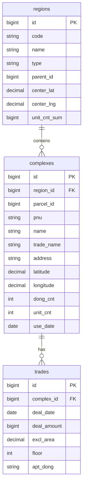

# 최소 ERD

## 좌표 정책

- `parcel` 테이블은 만들지 않는다.
- 프론트 호환용 `parcelId`는 `complexes.parcel_id`로 제공한다.
- 지도 마커는 `complexes.latitude`, `complexes.longitude`를 사용한다.
- 좌표 없는 단지는 지도 마커에서 제외한다.
- 검색/상세에서는 좌표가 없어도 결과를 반환할 수 있다.
- 동일 필지 복수 단지는 v1에서 같은 좌표 공유를 허용한다.

## 인덱스

- `regions(code)`
- `regions(parent_id)`
- `complexes(region_id)`
- `complexes(parcel_id)`
- `complexes(name)`
- `complexes(latitude, longitude)`
- `trades(complex_id, deal_date)`
- `trades(deal_amount)`
- `trades(excl_area)`

## 제약

- `complexes.region_id`는 `regions.id`를 참조한다.
- `trades.complex_id`는 `complexes.id`를 참조한다.
- `deal_amount`는 만원 단위 정수로 저장한다.
- `use_date`는 사용승인일이 없으면 null을 허용한다.
