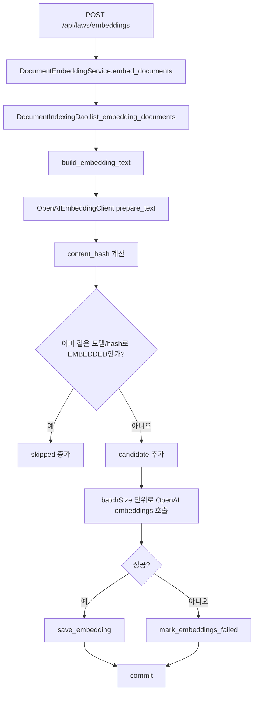

# 법령 RAG 임베딩과 벡터 인덱싱

이 문서는 `law_documents`에 저장된 법령 조문을 임베딩하고, pgvector 기반 유사도 검색에 사용할 수 있게 만드는 과정을 설명한다.

## 목적

임베딩 단계의 목적은 조문 텍스트를 벡터로 변환해 `law_documents.embedding`에 저장하는 것이다. 이후 질문도 같은 임베딩 모델로 벡터화하고, 조문 벡터와 cosine similarity를 계산해 후보 조문을 찾는다.

## 관련 파일

| 파일 | 책임 |
|---|---|
| `rag/controller/indexing_controller.py` | 임베딩 생성/상태 조회 API |
| `rag/service/indexing_service.py` | 임베딩 대상 선별, 배치 처리, 실패 처리 |
| `rag/dao/indexing_dao.py` | 임베딩 저장과 상태 집계 |
| `rag/client/openai_embedding_client.py` | 공통 OpenAI 임베딩 클라이언트 re-export |
| `app/chatbot/embedding/openai_client.py` | 실제 OpenAI 임베딩 호출 구현 |
| `rag/model/entities.py` | `law_documents.embedding` 모델 정의 |
| `db/init/01_schema.sql` | `vector(1536)` 컬럼과 HNSW index 정의 |

## 데이터 모델

`law_documents`의 임베딩 관련 컬럼은 다음과 같다.

| 컬럼 | 설명 |
|---|---|
| `embedding` | 조문 임베딩 벡터. PostgreSQL에서는 `vector(1536)` |
| `embedding_model` | 임베딩에 사용한 모델명 |
| `embedding_status` | `PENDING`, `EMBEDDED`, `FAILED` |
| `embedding_error` | 실패 메시지 |
| `embedding_content_hash` | 임베딩 입력 텍스트의 SHA-256 hash |
| `embedded_at` | 임베딩 저장 시각 |

PostgreSQL 스키마에는 다음 인덱스가 있다.

```sql
CREATE INDEX IF NOT EXISTS idx_law_documents_embedding_hnsw
ON law_documents USING hnsw (embedding vector_cosine_ops)
WHERE embedding IS NOT NULL;
```

이 인덱스는 `embedding`이 있는 조문만 대상으로 cosine distance 검색을 빠르게 수행한다.

## 임베딩 모델

기본 설정은 `app/chatbot/embedding/openai_client.py`에 있다.

| 항목 | 값 |
|---|---|
| 기본 모델 | `text-embedding-3-large` |
| 차원 수 | `1536` |
| 최대 입력 토큰 | `8000` |
| API 키 | `OPENAI_API_KEY` |
| 모델 override | `OPENAI_EMBEDDING_MODEL` |
| 차원 override | `OPENAI_EMBEDDING_DIMENSIONS`, 단 현재 구현은 1536만 허용 |

차원 수를 1536으로 고정한 이유는 DB 컬럼이 `vector(1536)`으로 정의되어 있기 때문이다. 모델 차원과 DB 컬럼 차원이 다르면 저장과 검색이 실패한다.

## 임베딩 입력 텍스트

임베딩 대상 텍스트는 `DocumentEmbeddingService.embed_documents()`가 각 `LawDocument`를 `build_embedding_text()`로 변환해 만든다.

형식:

```text
법령명: {law_name}
법령구분: {law_type}
조문: {article_no}
조문제목: {article_title}
내용:
{content}
```

조문 본문만 임베딩하지 않고 법령명, 조문번호, 조문제목을 함께 넣는 이유는 질문이 “민법 제565조”, “계약금”, “부동산등기법”처럼 조문 주변 메타데이터를 포함할 수 있기 때문이다.

## API

### 임베딩 생성

Endpoint:

```http
POST /api/laws/embeddings
```

Request DTO:

```json
{
  "batchSize": 100,
  "retryFailed": false,
  "limit": 500
}
```

| 필드 | 기본값 | 제약 | 설명 |
|---|---:|---|---|
| `batchSize` | `100` | `1 <= batchSize <= 500` | 한 번에 OpenAI API로 보낼 조문 수 |
| `retryFailed` | `false` | boolean | 이전에 실패한 동일 hash 조문을 다시 시도할지 여부 |
| `limit` | `null` | `>= 1` | 이번 실행에서 처리할 최대 후보 수 |

Response DTO:

```json
{
  "candidates": 100,
  "embedded": 100,
  "failed": 0,
  "skipped": 20,
  "model": "text-embedding-3-large",
  "dimensions": 1536
}
```

### 임베딩 상태 조회

Endpoint:

```http
GET /api/laws/embeddings/status
```

Response DTO:

```json
{
  "total": 1200,
  "withEmbedding": 1200,
  "withoutEmbedding": 0,
  "statuses": [
    {
      "status": "EMBEDDED",
      "count": 1200
    }
  ]
}
```

## 처리 순서



## 중복 처리와 재실행 안정성

임베딩 작업은 재실행을 고려해 설계되어 있다.

`DocumentEmbeddingService`는 각 조문의 임베딩 입력 텍스트를 SHA-256으로 hash 한다. 다음 조건을 모두 만족하면 다시 임베딩하지 않는다.

1. `embedding`이 존재한다.
2. `embedding_model`이 현재 클라이언트 모델과 같다.
3. `embedding_content_hash`가 현재 입력 텍스트 hash와 같다.
4. `embedding_status`가 `EMBEDDED`다.

이 조건 덕분에 이미 임베딩된 조문은 `skipped`로 처리된다.

이전에 실패한 조문도 같은 모델과 같은 hash라면 기본적으로 다시 시도하지 않는다. 다시 시도하려면 `retryFailed=true`로 호출한다.

## 검색 단계에서의 사용

질문 검색은 `LegalRagQueryDao.nearest_law_documents()`에서 수행한다.

PostgreSQL 연결일 때:

```python
distance = LawDocument.embedding.cosine_distance(query_embedding)
score = max(0.0, 1.0 - distance)
```

PostgreSQL이 아닌 테스트 환경일 때:

```python
python_rank_documents()
```

`python_rank_documents()`는 DB의 pgvector 연산을 사용할 수 없는 환경에서 Python으로 cosine similarity를 계산하는 fallback이다. 운영 경로는 PostgreSQL + pgvector이고, fallback은 테스트와 로컬 제한 환경을 위한 보조 경로다.

## 실행 예시

서버 실행:

```powershell
python -m uvicorn app.main:app --reload --host 127.0.0.1 --port 8000
```

임베딩 상태 확인:

```powershell
Invoke-RestMethod `
  -Method Get `
  -Uri http://127.0.0.1:8000/api/laws/embeddings/status
```

임베딩 생성:

```powershell
Invoke-RestMethod `
  -Method Post `
  -Uri http://127.0.0.1:8000/api/laws/embeddings `
  -ContentType "application/json" `
  -Body '{"batchSize":100,"retryFailed":false}'
```

실패분 재시도:

```powershell
Invoke-RestMethod `
  -Method Post `
  -Uri http://127.0.0.1:8000/api/laws/embeddings `
  -ContentType "application/json" `
  -Body '{"batchSize":50,"retryFailed":true}'
```

## 확인 SQL

```sql
SELECT embedding_status, count(*)
FROM law_documents
GROUP BY embedding_status
ORDER BY embedding_status;

SELECT embedding_model, count(*)
FROM law_documents
WHERE embedding IS NOT NULL
GROUP BY embedding_model;

SELECT id, law_name, article_no, article_title, embedding_status, embedding_error
FROM law_documents
WHERE embedding_status = 'FAILED'
ORDER BY id
LIMIT 20;
```

## 주의사항

1. `OPENAI_API_KEY`가 없으면 임베딩 클라이언트 생성이 실패한다.
2. DB 컬럼이 `vector(1536)`이므로 임베딩 차원도 반드시 1536이어야 한다.
3. `law_documents.csv`에는 임베딩 벡터가 포함되어 있어, CSV seed를 사용하면 새 로컬 환경에서도 별도 임베딩 호출 없이 검색할 수 있다.
4. 조문 본문이나 제목이 바뀌면 hash가 바뀌므로 다음 임베딩 실행 때 다시 처리 대상이 된다.
5. 임베딩 실패 시 해당 배치 전체가 `FAILED`로 표시된다.

## 검증

임베딩 API 자체는 OpenAI API와 DB 상태에 의존한다. 로직 검증은 검색/랭킹 테스트와 함께 확인한다.

```powershell
python -m pytest tests/test_legal_rag_query_ranking.py
```

실제 검색 품질은 QA runner로 확인한다.

```powershell
python outputs/legal_rag_qa_30_runner.py
```
