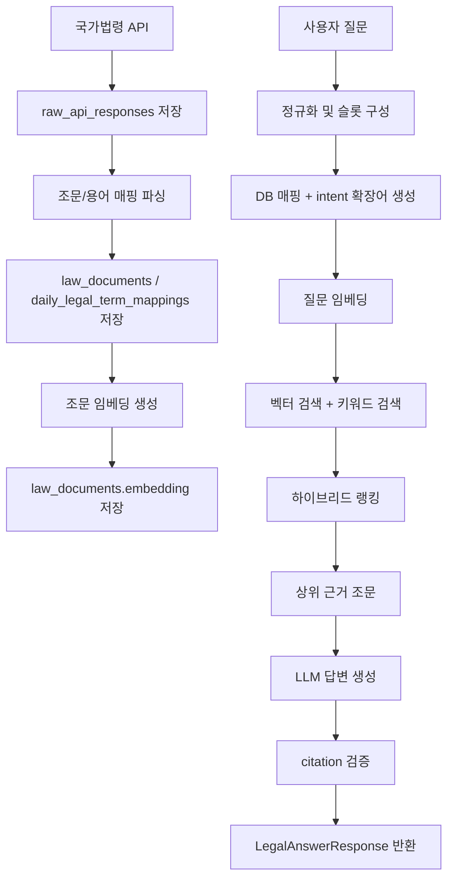

# 법령 RAG 작업 개요

이 문서는 아파트 매매 관련 법령 RAG 기능의 전체 구조를 요약한다. 세부 내용은 데이터 적재, 임베딩, 답변 생성 문서로 나누어 관리한다.

## 문서 목록

| 문서 | 목적 |
|---|---|
| [legal-rag-data-ingestion.md](./legal-rag-data-ingestion.md) | 국가법령 API 호출, Raw 저장, 조문/용어 매핑 파싱, CSV 이관 구조 |
| [legal-rag-embedding-indexing.md](./legal-rag-embedding-indexing.md) | `law_documents` 조문 임베딩 생성, pgvector 저장, 검색 인덱스 |
| [legal-rag-answer-generation.md](./legal-rag-answer-generation.md) | 질문 정규화, 확장어, 하이브리드 검색, LLM 답변 생성, citation 검증 |

## 구현 범위

현재 구현은 `app/chatbot/features/legal_contract/rag` 패키지에 집중되어 있다.

```text
app/chatbot/features/legal_contract/rag
├── client      # 국가법령 API, OpenAI 임베딩 클라이언트 연결
├── controller  # FastAPI 라우터와 Depends provider
├── dao         # DB 조회/저장 계층
├── dto         # 요청/응답 모델
├── model       # SQLAlchemy 테이블 매핑
├── parser      # 국가법령 API 응답 파싱
└── service     # 적재, 임베딩, 검색, 답변 생성 비즈니스 로직
```

챗봇 도구 연결은 RAG 패키지 바깥의 다음 파일에서 수행한다.

- `app/chatbot/features/legal_contract/service.py`
- `app/chatbot/features/legal_contract/slots.py`
- `app/chatbot/service/tools/legal_contract_tool.py`

## 전체 처리 흐름



## 주요 API

| 구분 | Method | Path | 설명 |
|---|---:|---|---|
| 법령 Raw 수집 | POST | `/api/laws/ingest/raw` | 국가법령 API에서 법령 본문 Raw JSON 수집 |
| 법령 조문 파싱 | POST | `/api/laws/parse` | Raw JSON을 `law_documents`로 파싱 |
| 용어 Raw 수집 | POST | `/api/terms/ingest/raw` | 일상어-법률어 매핑 Raw JSON 수집 |
| 용어 매핑 파싱 | POST | `/api/terms/parse` | Raw JSON을 `daily_legal_term_mappings`로 파싱 |
| 임베딩 생성 | POST | `/api/laws/embeddings` | `law_documents` 조문 임베딩 생성 |
| 임베딩 상태 | GET | `/api/laws/embeddings/status` | 임베딩 완료/대기/실패 상태 조회 |
| 법령 근거 검색 | POST | `/api/laws/query` | 질문에 맞는 근거 조문 검색 |

챗봇 답변 생성은 위 검색 API만 직접 호출하는 방식이 아니라, 챗봇 도구에서 `run_legal_contract()`를 통해 검색 후 `LegalAnswerService`까지 이어진다.

## 핵심 테이블

| 테이블 | 역할 |
|---|---|
| `raw_api_responses` | 국가법령 API 응답 원본 저장 |
| `law_documents` | 파싱된 조문, 항 단위 문서, 임베딩, 메타데이터 저장 |
| `daily_legal_term_mappings` | 일상어와 법률어 매핑 저장 |

`law_documents.embedding`은 `vector(1536)` 타입이며, PostgreSQL에서는 HNSW cosine index를 사용한다.

## 필요한 환경변수

| 환경변수 | 사용 위치 | 설명 |
|---|---|---|
| `DATABASE_URL` | `app/database.py` | PostgreSQL 연결 문자열 |
| `LAW_API_OC` | `rag/client/law_api_client.py` | 국가법령 API 인증 키 |
| `OPENAI_API_KEY` | 임베딩/답변 생성 | OpenAI API 키 |
| `OPENAI_EMBEDDING_MODEL` | `app/chatbot/embedding/openai_client.py` | 기본값 `text-embedding-3-large` |
| `OPENAI_CHAT_MODEL` | `rag/service/answer_generator.py` | 기본값 `gpt-5.5` |

문서와 예제에는 실제 키 값을 기록하지 않는다.

## 검증 방법

핵심 단위 테스트:

```powershell
python -m pytest tests/test_legal_rag_parser.py tests/test_legal_rag_query_intent.py tests/test_legal_rag_query_ranking.py tests/test_legal_rag_answer.py
```

실제 DB와 OpenAI API를 사용하는 QA 실행:

```powershell
python outputs/legal_rag_qa_30_runner.py
```

QA runner는 단위 테스트를 대체하지 않는다. 단위 테스트는 파서, 랭킹, 답변 검증 로직을 고정하고, QA runner는 실제 데이터와 모델을 사용한 품질 점검 용도다.
