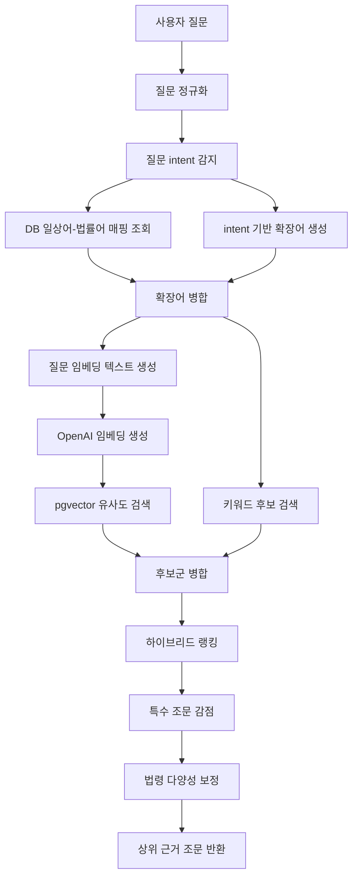

# 법령 RAG 검색 품질 튜닝 과정

## 1. 작업 목적

이번 작업의 목표는 아파트 매매 관련 질문이 들어왔을 때, 단순히 비슷한 문장을 찾는 수준을 넘어서 실제 답변에 사용할 수 있는 법령 조문을 안정적으로 검색하는 것이었다.

초기 목표 질문은 다음과 같았다.

1. 30억 아파트 매매 시 알아야 할 법률이 있을까?
2. 아파트 매매 시 세금 책정 관련 법을 알려줘.
3. 매매 계약서에서 중요하게 볼 부분은 어디야?

이후 다음과 같은 생활어 기반 질문까지 대응 범위를 넓혔다.

- 집을 살 때 알아야 할 법이 있을까?
- 아파트 매매계약 후 신고해야 하는 게 있어?
- 세입자 있는 집을 사도 괜찮아?
- 명의 이전은 어떤 법과 관련 있어?
- 계약금을 냈는데 계약을 취소할 수 있어?
- 부모님이 돈을 보태주면 문제가 있어?
- 등기부에서 빚 잡힌 집인지 보려면 뭘 봐야 해?

핵심 과제는 사용자가 쓰는 일상 표현을 법률 검색에 적합한 표현으로 바꾸고, 검색된 조문 중 답변에 적합한 근거를 상위에 올리는 것이었다.

## 2. 초기 검색 방식의 한계

초기 구조는 질문을 임베딩한 뒤, `law_documents.embedding`에 저장된 조문 임베딩과 cosine similarity를 비교하는 방식이었다.

```text
사용자 질문
-> 질문 임베딩
-> 조문 임베딩과 유사도 비교
-> 상위 조문 반환
```

이 방식은 다음과 같은 질문에는 비교적 잘 동작했다.

- 계약금을 냈는데 계약을 취소할 수 있어?
- 소유권 이전등기는 어떤 법과 관련 있어?
- 부동산매매업자가 아파트를 팔 때 세금 계산은 어떻게 해?

하지만 다음 유형에서는 문제가 있었다.

| 질문 유형 | 문제 |
|---|---|
| 생활어 질문 | “빚 잡힌 집”, “전세 낀 집” 같은 표현이 조문 표현과 직접 매칭되지 않음 |
| 넓은 질문 | “집 살 때 알아야 할 법”처럼 여러 법률 쟁점이 섞인 질문에서 일부 조문만 검색됨 |
| 특수 조문 쏠림 | 일반 세금 질문에 부동산매매업자 특례 조문이 올라오는 문제 |
| 실무형 질문 | 계약 전 확인사항, 등기부 위험 권리처럼 여러 근거가 필요한 질문에서 답변 범위가 좁아짐 |

즉, 단순 벡터 유사도만으로는 사용자의 의도와 실제 법률 쟁점을 충분히 연결하기 어려웠다.

## 3. 튜닝 방향

검색 품질을 높이기 위해 다음 방향으로 튜닝했다.

```text
질문 정규화
-> 일상어-법률어 확장
-> 질문 intent 감지
-> 후보군 확대
-> 하이브리드 랭킹
-> 특수 조문 감점
-> 결과 다양성 보정
-> QA runner 반복 평가
```

중요한 기준은 특정 테스트 질문에만 맞는 강한 규칙을 넣지 않는 것이었다.

예를 들어 “집 살 때 알아야 할 법”이라는 질문에 항상 특정 조문 번호를 강제로 넣으면 해당 질문의 결과는 좋아질 수 있다. 하지만 사용자가 조금 다른 질문을 하면 검색이 오히려 왜곡될 수 있다.

그래서 이번 튜닝은 강한 바인딩이 아니라 약한 신호를 여러 개 조합하는 방식으로 진행했다.

## 4. 질문 정규화

먼저 질문을 검색에 안정적인 형태로 바꾸는 정규화 단계를 추가했다.

관련 파일:

```text
app/chatbot/features/legal_contract/normalization.py
```

정규화 처리 내용:

1. Unicode NFC 정규화
2. 문장부호 정리
3. 소문자화
4. 연속 공백 압축
5. 앞뒤 공백 제거

입력 슬롯은 다음 구조로 정리했다.

```json
{
  "original_query": "계약금을 냈는데 계약을 취소할 수 있어?",
  "normalized_query": "계약금을 냈는데 계약을 취소할 수 있어",
  "expanded_terms": []
}
```

이렇게 원문 질문과 검색용 질문을 분리해, 답변에는 원문을 유지하면서 검색에는 정규화된 질문을 사용할 수 있게 했다.

## 5. 일상어-법률어 매핑

다음으로 사용자의 일상 표현을 법률 표현으로 확장했다.

관련 테이블:

```text
daily_legal_term_mappings
```

관련 파일:

```text
app/chatbot/features/legal_contract/rag/dao/query_dao.py
app/chatbot/features/legal_contract/rag/service/query_service.py
```

예시는 다음과 같다.

| 일상어 | 확장 법률어 |
|---|---|
| 집 | 주택, 부동산 |
| 계약금 | 해약금 |
| 명의 이전 | 소유권 이전등기, 권리 이전 |
| 세입자 | 임차인, 임대차, 대항력 |
| 전세 낀 집 | 임대인의 지위 승계, 보증금 반환 |
| 빚 잡힌 집 | 저당권, 근저당권, 압류, 가압류 |

이 매핑은 처음에는 국가법령 API의 용어 매핑을 기반으로 수집했고, 이후 부동산 매매와 관련 있는 항목만 필터링해 DB에 반영했다.

이 단계의 효과는 사용자의 표현과 법령 조문 사이의 표현 차이를 줄이는 것이다.

## 6. 질문 Intent 감지

단순 매핑만으로는 질문의 유형을 충분히 알 수 없었다. 그래서 질문 intent를 추가했다.

관련 파일:

```text
app/chatbot/features/legal_contract/rag/service/query_intent.py
```

현재 감지하는 intent는 다음과 같다.

| Intent | 의미 |
|---|---|
| `BROAD` | 집 살 때 알아야 할 법처럼 넓은 질문 |
| `TAX` | 세금, 취득세, 양도소득세, 증여세 |
| `CONTRACT` | 계약금, 해제, 계약 성립 |
| `CHECKLIST` | 계약서에서 중요하게 볼 부분 |
| `PRE_CONTRACT_CHECK` | 계약 전 확인사항 |
| `REGISTRATION` | 명의 이전, 소유권 이전등기 |
| `LEASE` | 세입자, 전세, 임대차, 보증금 |
| `BROKER` | 공인중개사, 확인·설명 의무 |
| `RISK` | 근저당, 압류, 가압류, 위험 권리 |
| `FALSE_PRICE` | 다운계약서, 허위 거래금액 |

예를 들어 “전세 낀 아파트를 사면 보증금은 누가 돌려줘야 해?”라는 질문은 `LEASE` intent로 분류된다. 이 intent를 기반으로 대항력, 임대인 지위 승계, 보증금 반환 같은 검색어를 추가한다.

## 7. Intent 기반 확장어

DB 매핑 외에도 intent별 확장어를 코드에서 보강했다.

관련 파일:

```text
app/chatbot/features/legal_contract/rag/service/query_expansion.py
```

예시는 다음과 같다.

| Intent | 확장 방향 |
|---|---|
| `TAX` | 취득세, 양도소득세, 증여세 |
| `CONTRACT` | 매매의 의의, 대금 지급, 계약금, 해약금 |
| `LEASE` | 임차인, 대항력, 임대인의 지위 승계, 보증금 반환 |
| `RISK` | 저당권, 근저당권, 압류, 가압류, 가처분 |
| `FALSE_PRICE` | 실제 거래가격, 거짓 신고, 거래계약신고필증 |

여기서 중요한 점은 조문 번호를 직접 박지 않았다는 것이다.

예를 들어 “민법 제563조”를 확장어에 강제로 넣으면 특정 질문에서는 잘 맞지만, 비슷한 표현의 다른 질문에서는 검색이 고정될 수 있다. 그래서 확장어는 조문 번호보다 법률 개념 중심으로 구성했다.

## 8. 후보군 확대

초기에는 `topK`와 가까운 수의 후보만 검색했다. 하지만 질문이 넓거나 표현이 애매한 경우, 정답 조문이 초반 후보군에 들어오지 않는 문제가 있었다.

그래서 후보군을 확대했다.

관련 파일:

```text
app/chatbot/features/legal_contract/rag/service/query_service.py
```

현재 주요 기본값은 다음과 같다.

```text
DEFAULT_TOP_K = 7
DEFAULT_MIN_SCORE = 0.45
DEFAULT_CANDIDATE_K = 70
```

후보군 계산:

```text
일반 질문: max(70, topK * 10)
BROAD 질문: max(candidateK, topK * 20)
```

이렇게 한 이유는 최종 결과는 7개만 보여주더라도, 재정렬을 하기 전에는 충분히 넓은 후보군이 필요하기 때문이다.

## 9. 하이브리드 랭킹

검색 결과는 단순 벡터 유사도만으로 정렬하지 않고, 하이브리드 점수로 재정렬한다.

관련 파일:

```text
app/chatbot/features/legal_contract/rag/service/query_ranking.py
```

최종 점수 개념:

```text
score = min(1.0, vectorScore + keywordScore + intentFocusScore) - penalty
score = max(0.0, score)
```

각 점수의 의미는 다음과 같다.

| 점수 | 의미 |
|---|---|
| `vectorScore` | 질문 임베딩과 조문 임베딩의 cosine similarity |
| `keywordScore` | 법령명, 조문 제목, 조문 본문에 핵심어가 포함되는지 |
| `intentFocusScore` | 질문 intent와 맞는 핵심 법률 개념이 조문에 있는지 |
| `penalty` | 일반 질문에 특수 조문이 잘못 올라오는 것을 줄이는 감점 |

키워드 점수는 다음 위치에 따라 다르게 부여된다.

| 위치 | 기본 가산점 |
|---|---:|
| 법령명 | `0.12` |
| 조문 제목 | `0.10` |
| 조문 본문 | `0.04` |

확장어 점수는 원문 질문의 핵심어보다 약하게 적용했다. 확장어가 너무 강하면 검색이 사용자의 실제 질문보다 확장어 방향으로 끌려가기 때문이다.

## 10. 특수 조문 감점

튜닝 중 가장 중요한 문제 중 하나는 특수 조문이 일반 질문에 잘못 올라오는 것이었다.

예시:

| 질문 | 잘못 올라올 수 있는 조문 |
|---|---|
| 아파트 매매 시 세금 알려줘 | 부동산매매업자 세액 계산 특례 |
| 소유권 이전등기 알려줘 | 소유권 일부이전 조문 |
| 집 살 때 알아야 할 법 | 정의 조문, 자료관리 조문 |

이를 줄이기 위해 penalty를 추가했다.

| 감점 대상 | 감점 |
|---|---:|
| 일반 질문에서 특수 문맥 조문 | `0.04` |
| 일반 세금 질문에서 부동산매매업자 특례 조문 | `0.07` |
| 일반 등기 질문에서 일부이전 조문 | `0.08` |
| broad 질문에서 정의/자료관리 조문 | `0.06` |

다만 사용자가 직접 특수 상황을 말하면 감점하지 않는다.

예를 들어:

- “부동산매매업자가 아파트를 팔 때 세금 계산은 어떻게 해?”
- “아파트 지분 일부만 넘길 때 등기는 어떻게 해?”

이런 질문에서는 부동산매매업자 특례나 일부이전 조문이 정답 후보가 될 수 있으므로 감점을 해제한다.

## 11. 법령 다양성 보정

Broad 질문에서는 상위 결과가 같은 법령에 몰리는 문제가 있었다.

예를 들어 “집 살 때 알아야 할 법”이라는 질문은 계약, 신고, 등기, 세금, 중개, 임대차 위험이 함께 들어간다. 그런데 상위 결과가 한 법령에만 몰리면 답변도 좁아진다.

그래서 같은 법령이 상위 결과를 과도하게 차지하지 않도록 다양성 보정을 넣었다.

주요 기준:

```text
MAX_DOCUMENTS_PER_LAW_IN_TOP_RESULTS = 2
DIVERSITY_SCORE_TOLERANCE = 0.05
```

같은 법령에서 이미 2개가 선택되었고, 점수 차이가 크지 않은 다른 법령 후보가 있으면 다른 법령의 조문을 우선 포함한다.

단, 대체 후보의 점수가 너무 낮으면 같은 법령 후보를 유지한다. 다양성을 위해 품질이 낮은 조문을 억지로 넣지는 않는다.

## 12. QA Runner 기반 반복 평가

검색 튜닝은 QA runner 결과를 보면서 반복했다.

관련 파일:

```text
outputs/legal_rag_qa_30_runner.py
```

평가 질문은 다음 세 그룹으로 확장했다.

1. 초기 계획 질문 10개
2. 기존 추가 질문 10개
3. 생활어 기반 추가 질문 10개

총 30개 질문을 실행하면서 다음 기준으로 확인했다.

| 평가 기준 | 설명 |
|---|---|
| 질문 의도 적합성 | 검색된 조문이 사용자가 물은 핵심 의도와 맞는가 |
| citation 적합성 | 답변 문장이 실제 인용 조문으로 뒷받침되는가 |
| 누락 쟁점 | 답변이 중요한 법률 쟁점을 빠뜨리지 않았는가 |
| 특수 조문 오탐 | 일반 질문에 특수 조문이 잘못 올라오지 않았는가 |
| 답변 가능성 | 충분한 근거가 있을 때 답변을 생성하는가 |

초기에는 단순히 `success=true`, citation 존재, retrieval score가 높으면 좋은 결과로 보기도 했다. 하지만 실제 검토 결과, 높은 점수라도 질문 의도와 맞지 않으면 좋은 답변이 아니라는 점을 확인했다.

예를 들어 “아파트 매매 시 세금” 질문에 부동산매매업자 특례 조문으로 답하면 citation은 맞아도 사용자 의도에는 맞지 않는다. 그래서 평가는 검색 점수보다 질문 의도 적합성을 더 중요하게 보게 되었다.

## 13. 주요 개선 사례

### 세금 질문

초기에는 일반 아파트 매매 세금 질문에서 부동산매매업자 세액 계산 특례 조문이 올라왔다.

튜닝 후에는 일반 세금 질문에서 취득세, 양도소득세 방향으로 검색되도록 개선했다.

적용한 조치:

- `TAX` intent 추가
- 취득세, 양도소득세, 증여세 확장어 추가
- 부동산매매업자 특례 조문 penalty 추가
- 사용자가 “부동산매매업자”라고 직접 말한 경우 penalty 해제

### 명의 이전 질문

초기에는 일반 명의 이전 질문에 소유권 일부이전 조문이 올라오는 문제가 있었다.

튜닝 후에는 소유권 이전등기, 등기신청인 관련 조문이 더 자연스럽게 검색되도록 개선했다.

적용한 조치:

- `REGISTRATION` intent 추가
- 명의 이전을 소유권 이전등기, 권리 이전으로 확장
- 일반 등기 질문에서 일부이전 조문 penalty 적용
- 사용자가 “지분 일부”를 직접 말한 경우 penalty 해제

### 전세 낀 집 질문

초기에는 “전세 낀 아파트를 사면 보증금은 누가 돌려줘야 해?” 같은 질문에서 답변 근거를 충분히 찾지 못했다.

튜닝 후에는 임차인, 대항력, 임대인의 지위 승계, 보증금 반환 방향으로 검색되도록 개선했다.

적용한 조치:

- `LEASE` intent 추가
- 세입자, 전세, 보증금 표현 확장
- 임대차 관련 focus term 보정

### 등기부 위험 권리 질문

초기에는 근저당권만 잡고 압류, 가압류, 가처분, 전세권, 임차권등기 등 다른 위험 권리 설명이 부족했다.

튜닝 후에는 위험 권리 intent를 별도로 감지하고 관련 표현을 확장했다.

적용한 조치:

- `RISK` intent 추가
- 저당권, 근저당권, 압류, 가압류, 가처분 확장
- broad intent가 과도하게 붙지 않도록 예외 처리

## 14. 최종 검색 구조

현재 검색 흐름은 다음과 같다.



이 구조는 하나의 강한 규칙이 아니라 여러 약한 신호를 합산하는 방식이다.

## 15. 튜닝 과정에서 피한 방식

일부 방식은 단기적으로 점수를 올릴 수 있지만, 일반화 성능을 해칠 수 있어 피했다.

| 피한 방식 | 이유 |
|---|---|
| 질문별 정답 조문 강제 매핑 | 테스트 질문에는 맞지만 다른 질문에 취약 |
| 조문 번호를 확장어에 대량 추가 | 검색이 특정 조문으로 고정될 위험 |
| broad 질문에 카테고리별 조문 강제 할당 | 질문이 조금 달라졌을 때 불필요한 법령이 섞일 수 있음 |
| retrieval score만으로 품질 판단 | 점수가 높아도 질문 의도와 다를 수 있음 |
| LLM이 만든 citation 신뢰 | 모델이 없는 document id를 만들 수 있으므로 서버 검증 필요 |

## 16. 현재 한계

튜닝 후에도 남은 한계는 있다.

1. 넓은 생활법률 질문은 여전히 여러 쟁점을 분해해야 더 좋아진다.
2. 법령 조문만으로는 실무 체크리스트형 답변이 부족할 수 있다.
3. 등기부 갑구/을구 해석처럼 법령 조문 외 안내 지식이 필요한 영역이 있다.
4. QA runner 결과는 사람이 직접 평가해야 의미가 있다.

특히 “집 살 때 계약 전에 꼭 확인해야 할 법적 사항”처럼 넓은 질문은 계약, 등기, 세금, 중개, 임대차, 권리위험을 함께 다뤄야 한다. 현재 구조는 이 중 관련 조문을 검색할 수 있지만, 질문을 여러 하위 쟁점으로 자동 분해하는 단계는 아직 제한적이다.

## 17. 결론

이번 검색 튜닝의 핵심은 다음 한 문장으로 정리할 수 있다.

> 법령 RAG 검색 품질은 단순 벡터 유사도보다, 사용자의 생활어를 법률 쟁점으로 변환하고 여러 약한 신호를 조합해 근거 조문을 재정렬하는 과정에서 크게 개선된다.

최종적으로 적용한 개선은 다음과 같다.

1. 질문 정규화와 입력 슬롯 분리
2. DB 기반 일상어-법률어 매핑
3. 질문 intent 감지
4. intent 기반 확장어 보강
5. 벡터 후보군 확대
6. 키워드 후보 보강
7. 하이브리드 랭킹
8. 특수 조문 penalty
9. 법령 다양성 보정
10. QA runner 기반 반복 평가

이 과정을 통해 단일 조문형 질문뿐 아니라, 세금, 등기, 임대차, 계약금, 위험 권리처럼 실제 아파트 매매 상담에서 자주 나오는 질문에 더 안정적으로 대응할 수 있게 되었다.
